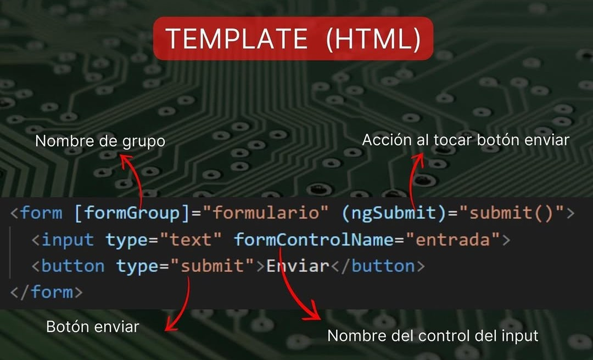
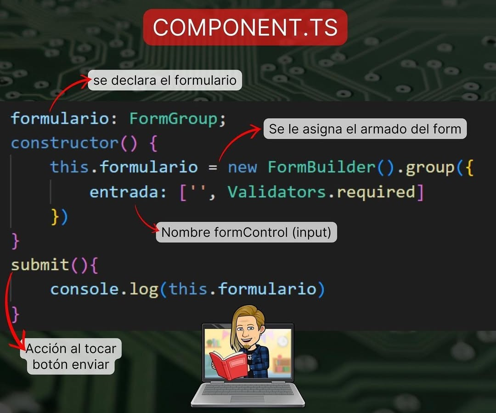
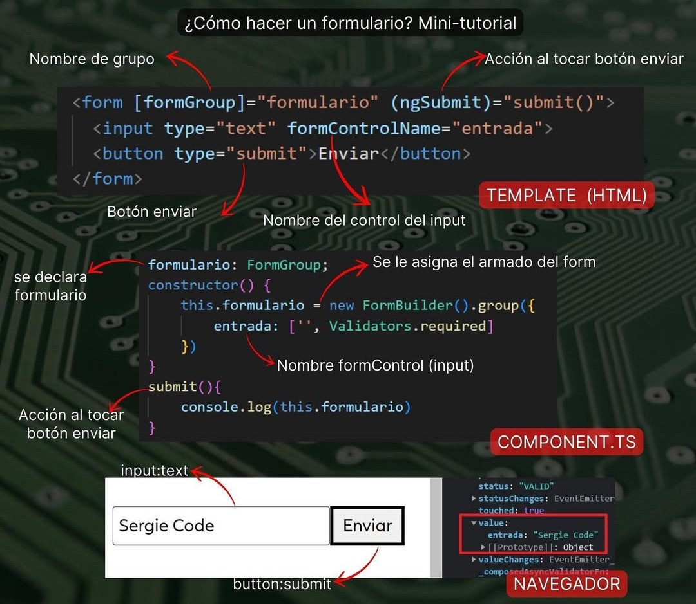
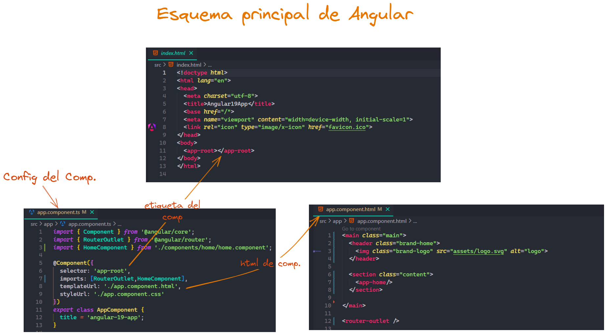
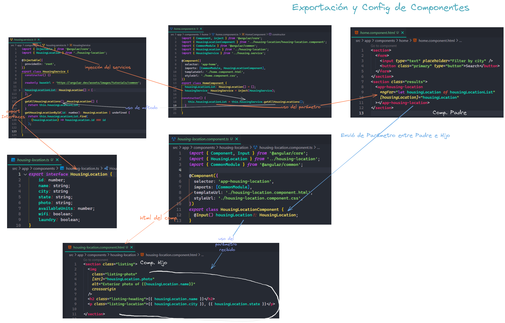

# Angular

<p align="center"><a href="https://angular.dev/installation" target="_blank"></a></p>

> Angular es un framework para aplicaciones web desarrollado en TypeScript, de código abierto, mantenido por Google, que se utiliza para crear y mantener aplicaciones web de una sola página.

## Comandos de Angular CLI
### **Comandos de generación**
```bash
ng new my-app                # Crear un nuevo proyecto de Angular
ng generate component home    # Crear un nuevo componente
ng g c components/home        # Crear un nuevo componente (abreviado)
ng generate component carpeta/comments --inline-template --inline-style # Crea un nuevo componente pero las plantillas y estilos estarán el mismo archivo typescript
ng generate service api       # Crear un nuevo servicio
ng g s services/data --skip-tests  # Crear un servicio sin archivos de prueba
ng generate module admin      # Crear un nuevo módulo
ng g m core --routing         # Crear un módulo con enrutamiento
ng generate directive highlight  # Crear una directiva personalizada
ng generate pipe currencyFormat  # Crear un pipe personalizado
ng generate interface user    # Crear una interfaz
ng generate interceptor interceptors/auth # Crea un interceptor
ng generate class models/user # Crear una clase
ng generate enum userRoles    # Crear un enum
ng g @angular/core:control-flow # actualiza las directivas ej: *ngFor a @For
```

### **Comandos de ejecución**
```bash
ng serve                     # Iniciar el servidor de desarrollo
ng serve --open              # Iniciar el servidor y abrir en el navegador
ng build                     # Compilar el proyecto para producción
ng build --prod              # Compilar el proyecto en modo producción
ng test                      # Ejecutar pruebas
ng lint                      # Revisar errores de linting
ng e2e                       # Ejecutar pruebas end-to-end
```

### **Comandos de configuración**
```bash
npm install -g @angular/cli  # Instalación de cli de angular (-g instalación global)
ng add @angular/material     # Instalar Angular Material
ng add @ngrx/store          # Agregar NgRx al proyecto
ng update                    # Actualizar Angular y dependencias
ng config                    # Ver o modificar la configuración
ng version                   # Mostrar la versión de Angular CLI
```

## Arquitectura y patrones de diseño:
- **Modularidad**: La aplicación se organiza en módulos que agrupan funcionalidades relacionadas. Esto permite que cada módulo sea desarrollado, probado y mantenido de forma independiente.
- **Componentes**: Son las unidades básicas de la interfaz. Cada componente tiene su propia lógica y vista.
- **Servicios e inyección de dependencias**: Los servicios permiten centralizar la lógica de negocio o el manejo de datos, y Angular se encarga de inyectarlos en los componentes que los necesiten.
- **Routing**: Angular utiliza un sistema de enrutamiento para gestionar la navegación entre vistas o componentes.
- **RxJS**: Se usa para manejar la programación reactiva, facilitando la gestión de flujos de datos asíncronos.

## Estructura de Carpeta de un Proyecto
```bash
my-angular-project/
|-- public/
|   |-- icons/
|   |-- images/
|   |-- favicon.ico
|-- src/
|   |-- app/
|   |   |-- auth/
|   |   |-- components/
|   |   |-- constants/
|   |   |-- pages/
|   |   |-- dashboard/
|   |   |-- interfaces/
|   |   |-- layouts/
|   |   |-- services/
|   |   |-- models/
|   |   |-- shared/
|   |   |   |-- my-shared-component/
|   |   |   |-- my-shared-service.service.ts
|   |   |-- app.component.css
|   |   |-- app.component.html
|   |   |-- app.component.ts
|   |   |-- app.config.ts
|   |   |-- app.routes.ts
|   |-- assets/
|   |   |-- images/
|   |   |-- styles/
|   |-- environments/
|   |-- index.html
|   |-- main.ts
|   |-- styles.css
|-- angular.json
|-- package.json
|-- README.md
|-- tsconfig.json
|-- tsconfig.app.json
|-- tsconfig.spec.json
```

### Descripción de Carpetas
* **`public/`**:
    * Contiene archivos estáticos que no son procesados por Webpack.
    * **`icons/`**: Iconos del sitio web (por ejemplo, archivos `.ico`, `.png`, `.svg`).
    * **`images/`**: Imágenes estáticas del sitio web.
    * **`favicon.ico`**: El icono de la pestaña del navegador.

* **`src/`**:
    * Contiene el código fuente de la aplicación Angular.

    * **`app/`**:
        * El módulo principal de la aplicación.
        * **`auth/`**: Componentes y servicios relacionados con la autenticación (login, registro, etc.).
        * **`components/`**: Componentes reutilizables de la aplicación.
        * **`constants/`**: Archivos con valores constantes utilizados en la aplicación (por ejemplo, URLs de API).
        * **`pages/`**: Componentes que representan las páginas principales de la aplicación.
        * **`dashboard/`**: Componentes y servicios relacionados con el panel de control de la aplicación.
        * **`interfaces/`**: Definiciones de interfaces TypeScript para tipos de datos.
        * **`layouts/`**: Componentes que definen la estructura general de las páginas (por ejemplo, encabezado, pie de página, barra lateral).
        * **`services/`**: Servicios Angular para la lógica de negocio y la comunicación con el servidor.
        * **`models/`**: Definiciones de clases de modelo para representar datos.
        * **`shared/`**: Componentes, servicios y módulos reutilizables en toda la aplicación.
            * **`my-shared-component/`**: Un componente compartido específico.
            * **`my-shared-service.service.ts`**: Un servicio compartido específico.
        * **`app.component.css`**: Estilos CSS específicos para el componente raíz de la aplicación.
        * **`app.component.html`**: La plantilla HTML del componente raíz de la aplicación.
        * **`app.component.ts`**: La clase TypeScript del componente raíz de la aplicación.
        * **`app.config.ts`**: Archivo de configuración de la aplicación.
        * **`app.routes.ts`**: Definiciones de las rutas de la aplicación.

    * **`assets/`**:
        * Recursos estáticos de la aplicación (imágenes, estilos, etc.).
        * **`images/`**: Imágenes utilizadas dentro de la aplicación.
        * **`styles/`**: Archivos de estilos CSS o SCSS.

    * **`environments/`**:
        * Configuraciones específicas para diferentes entornos (desarrollo, producción, etc.).

    * **`index.html`**:
        * La página HTML principal de la aplicación.

    * **`main.ts`**:
        * El punto de entrada principal de la aplicación Angular.

    * **`styles.css`**:
        * Estilos CSS globales de la aplicación.

* **Archivos de Configuración y Otros:**

    * **`angular.json`**:
        * Archivo de configuración de Angular CLI.

    * **`package.json`**:
        * Archivo de configuración de npm (dependencias, scripts, etc.).

    * **`README.md`**:
        * Documentación del proyecto.

    * **`tsconfig.json`**:
        * Archivo de configuración de TypeScript para todo el proyecto.

    * **`tsconfig.app.json`**:
        * Archivo de configuración de TypeScript específico para la aplicación.

    * **`tsconfig.spec.json`**:
        * Archivo de configuración de TypeScript específico para las pruebas unitarias.


## Componentes en Angular
Los componentes son bloques fundamentales en Angular. Representan una parte de la interfaz de usuario y tienen una estructura compuesta por HTML, CSS y TypeScript.

### Propiedades de los Componentes
- **selector**: Define el nombre con el cual el componente es referenciado en las plantillas.
- **standalone**: Indica si el componente requiere un NgModule o si puede funcionar de manera independiente.
- **imports**: Lista de dependencias del componente.
- **template**: Define el HTML del componente.
- **styleUrls**: Array con las rutas de los archivos CSS asociados.

### Estructura de los Componentes





- **Esquema de Angular:**


- **Configuración y Exportación entre componentes:**


## Notas Importantes
> .[!NOTE].
> la dependencia ``CommonModule``, solo se declara si se usa directivas que tenga iniciales ``ng`` en el html.

## Interfaces en Angular
Las interfaces en TypeScript definen la estructura de un objeto, asegurando un tipo de dato específico en Angular.

### Ejemplo:
```typescript
export interface HousingLocation {
    id: number;
    name: string;
    city: string;
    state: string;
    photo: string;
    availableUnits: number;
    wifi: boolean;
    laundry: boolean;
}
```


## Servicios en Angular
Los servicios en Angular permiten la comunicación entre componentes y la gestión de lógica de negocio, como la manipulación de datos o la realización de peticiones HTTP.


## Dependency Injection
Es un patrón de diseño utilizado en Angular para inyectar dependencias en los componentes o servicios de la aplicación, promoviendo modularidad y reutilización del código.


## Property Binding e Interpolación
- **Property Binding**: Asigna valores de propiedades de una clase a atributos de un elemento en el DOM.
  ```html
  
  ```
- **Interpolación**: Permite incrustar expresiones de TypeScript en la plantilla HTML.
  ```html
  <h1>{{ title }}</h1>
  ```


## **Estados (`state`)**  
🔹 En Angular, el **estado** se refiere a los datos que determinan la presentación de la interfaz de usuario en un componente.  
🔹 Se pueden gestionar los estados de varias maneras:

### **1. Estados locales en un componente (Usando propiedades de la clase)**
```typescript
export class ExampleComponent {
  isActive: boolean = true; // Estado booleano
  count: number = 0; // Estado numérico
}
```

### **2. Usando `@Input()` y `@Output()` para comunicación entre componentes**
Se explicará más adelante.

### **3. Uso de `BehaviorSubject` y Servicios para manejar estados globales**
```typescript
import { BehaviorSubject } from 'rxjs';

export class StateService {
  private state = new BehaviorSubject<boolean>(true);
  currentState = this.state.asObservable();

  changeState(value: boolean) {
    this.state.next(value);
  }
}
```
- Esto permite compartir el estado entre varios componentes.


## **Pasar parámetros entre componentes `Input` y `Output`**  

### **1️. De padre a hijo (usando `@Input`)**
Se usa `@Input()` para enviar datos desde un componente padre a su hijo.

#### **Componente Padre (`app-parent.component.ts`)**
```typescript
@Component({
  selector: 'app-parent',
  template: `<app-child [message]="parentMessage"></app-child>`
})
export class ParentComponent {
  parentMessage = 'Hola desde el Padre!';
}
```

#### **Componente Hijo (`app-child.component.ts`)**
```typescript
@Component({
  selector: 'app-child',
  template: `<p>{{ message }}</p>`
})
export class ChildComponent {
  @Input() message: string = '';
}
```


### **2️.De hijo a padre (usando `@Output` y `EventEmitter`)**
Se usa `@Output()` para enviar datos desde un hijo hacia su componente padre.

#### **Componente Hijo (`app-child.component.ts`)**
```typescript
import { Component, Output, EventEmitter } from '@angular/core';

@Component({
  selector: 'app-child',
  template: `<button (click)="sendMessage()">Enviar al Padre</button>`
})
export class ChildComponent {
  @Output() messageEvent = new EventEmitter<string>();

  sendMessage() {
    this.messageEvent.emit('Mensaje desde el hijo!');
  }
}
```

#### **Componente Padre (`app-parent.component.ts`)**
```typescript
@Component({
  selector: 'app-parent',
  template: `<app-child (messageEvent)="receiveMessage($event)"></app-child>
             <p>Mensaje recibido: {{ message }}</p>`
})
export class ParentComponent {
  message: string = '';

  receiveMessage(event: string) {
    this.message = event;
  }
}
```

## CommonModule
El módulo `CommonModule` proporciona directivas como `ngIf`, `ngFor` y otras utilidades necesarias para el desarrollo de aplicaciones en Angular.

## **Directivas**
### **Diferencia entre directivas ng vs @**
### ngFor, ngIF y etc: 
>Esta es la forma tradicional de manejar condicionales en Angular.

✅ **Ventajas:**
- Compatible con todas las versiones de Angular.
- Se integra bien con otras directivas estructurales como *ngFor.
- Más familiar para desarrolladores de Angular con experiencia.

⚠️ **Desventajas:**
- Puede generar código HTML más extenso con múltiples elementos <ng-template>.
- Menos legible en estructuras de control complejas.

### @for, @if y etc
>La nueva sintaxis es más parecida a las estructuras de control de TypeScript y mejora la legibilidad del código.

✅ **Ventajas:**
- Mayor claridad y legibilidad.
- Código más limpio y fácil de mantener.
- Soporte nativo en Angular 17+ sin necesidad de directivas estructurales.

⚠️ **Desventajas:**
- Requiere Angular 17 o superior.
- No es compatible con versiones anteriores de Angular.

### **Directivas Clásicas**  
| **Directiva**     | **Descripción** |
|-------------------|----------------|
| `*ngIf`          | Renderiza un elemento solo si la condición es verdadera. |
| `*ngIf...else`   | Permite definir un bloque alternativo cuando la condición es falsa. |
| `*ngFor`         | Itera sobre una lista y genera un elemento por cada ítem. |
| `*ngSwitch`      | Permite evaluar una variable y mostrar el bloque correspondiente. |
| `*ngSwitchCase`  | Define un caso dentro de un `*ngSwitch`. |
| `*ngSwitchDefault` | Define un caso por defecto dentro de un `*ngSwitch`. |
| `*ngTemplateOutlet` | Permite renderizar un `ng-template` dinámicamente. |
| `ngClass`        | Aplica clases dinámicamente en función de una expresión. |
| `ngStyle`        | Aplica estilos CSS dinámicamente. |
| `ngModel`        | Permite la vinculación bidireccional de datos en formularios. |
| `ngModelGroup`   | Agrupa varios `ngModel` en un formulario reactivo. |
| `ngContainer`    | Contenedor estructural que no genera un elemento real en el DOM. |
| `ngTemplate`     | Plantilla reutilizable en Angular. |
| `ngContent`      | Permite la proyección de contenido dentro de un componente. |
| `ngPlural`       | Permite definir reglas para pluralización de contenido basado en valores numéricos. |
| `ngPluralCase`   | Define casos específicos de pluralización. |

---

### **Nueva Sintaxis de Directivas (Angular 17+)**  

| **Directiva** | **Descripción** |
|--------------|----------------|
| `@if`       | Alternativa a `*ngIf`. Renderiza un elemento solo si la condición es verdadera. |
| `@else`     | Alternativa a `*ngIf...else`. Define un bloque alternativo cuando la condición es falsa. |
| `@for`      | Alternativa a `*ngFor`. Itera sobre una lista de elementos. |
| `@switch`   | Alternativa a `*ngSwitch`. Evalúa una variable y muestra el bloque correspondiente. |
| `@case`     | Alternativa a `*ngSwitchCase`. Define un caso dentro de un `@switch`. |
| `@default`  | Alternativa a `*ngSwitchDefault`. Define un caso por defecto dentro de un `@switch`. |

---

**¿Cuál es mejor?**  
🔹 **Si usas Angular 17+**, la nueva sintaxis `@if`, `@for`, y `@switch` es más limpia y legible.  
🔹 **Si trabajas con versiones anteriores**, las directivas clásicas siguen siendo la mejor opción.

### Ejemplo con @if y @else:
```typescript
<section>
  @if (isLoggedIn) {
    <h1>Bienvenido {{ username }}</h1>
    
    <button (click)="isLoggedIn = false">Cerrar sesión</button>
  } @else {
    <h2>Inicia sesión</h2>
    <button (click)="isLoggedIn = true">Iniciar sesión</button>
  }

  <app-games (addFavoriteEvent)="getFavorite($event)" username="{{ username }}"></app-games>

  @if (favGame !== '') {
    <p>Tu juego favorito es {{ favGame }}</p>
  }
</section>
```
### Ejemplo con *ngIf y *ngIf:
```typescript
<section>
  <ng-container *ngIf="isLoggedIn; else loginTemplate">
    <h1>Bienvenido {{ username }}</h1>
    
    <button (click)="isLoggedIn = false">Cerrar sesión</button>
  </ng-container>

  <ng-template #loginTemplate>
    <h2>Inicia sesión</h2>
    <button (click)="isLoggedIn = true">Iniciar sesión</button>
  </ng-template>

  <app-games (addFavoriteEvent)="getFavorite($event)" username="{{ username }}"></app-games>

  <p *ngIf="favGame !== ''">Tu juego favorito es {{ favGame }}</p>
</section>
```

## **Decoradores**  
Los **decoradores** en Angular son funciones que se utilizan para modificar clases, propiedades, métodos o parámetros.  

| **Decorador** | **Descripción** |
|--------------|----------------|
| `@Component` | Define una clase como un componente de Angular. |
| `@Directive` | Crea una directiva personalizada. |
| `@Pipe` | Define una clase como un Pipe para transformar datos. |
| `@Injectable` | Marca una clase como un servicio inyectable. |
| `@Input` | Permite recibir valores de un componente padre a hijo. |
| `@Output` | Permite emitir eventos del hijo al padre. |
| `@HostListener` | Escucha eventos del DOM en la directiva o componente. |
| `@HostBinding` | Vincula propiedades del DOM a la directiva o componente. |
| `@ViewChild` | Obtiene una referencia a un elemento hijo en la plantilla. |
| `@ViewChildren` | Obtiene referencias a múltiples elementos hijos en la plantilla. |
| `@ContentChild` | Obtiene una referencia a un elemento anidado dentro de `<ng-content>`. |
| `@ContentChildren` | Obtiene múltiples referencias de elementos anidados en `<ng-content>`. |

---

## Routing en Angular
El sistema de rutas en Angular permite la navegación entre componentes.

### Conceptos Claves
- **router-outlet**: Punto de anclaje donde se carga dinámicamente el contenido de una ruta.
- **[routerLink]**: Directiva utilizada para la navegación interna sin recargar la página.

Ejemplo:
```html
<a [routerLink]="['/home']">Inicio</a>
```

## Operadores de TypeScript en Angular
- **`?`** (Operador de encadenamiento opcional): Previene errores al acceder a propiedades de objetos indefinidos o nulos.
  ```typescript
  user?.name
  ```
- **`??`** (Operador de coalescencia nula): Proporciona un valor por defecto cuando una variable es `null` o `undefined`.
  ```typescript
  let name = user.name ?? 'Desconocido';
  ```

## Formularios Reactivos en Angular
Los formularios reactivos en Angular permiten manejar datos de entrada de manera programática.

### Propiedades:
- **[formGroup]**: Agrupa los controles de un formulario.
- **formControlName**: Asocia un input con un control en el `FormGroup`.
- **(submit)**: Maneja el evento de envío del formulario.

Ejemplo:
```html
<form [formGroup]="myForm" (submit)="onSubmit()">
  <input type="text" formControlName="name">
</form>
```

## **Propiedades**
| Propiedad  | Descripción |
|------------|------------|
| `class` | Aplica clases CSS a un elemento. |
| `style` | Aplica estilos en línea. |
| `[innerHTML]` | Inserta contenido HTML dentro de un elemento. |
| `[value]` | Define el valor de un input. |
| `[disabled]` | Habilita o deshabilita un elemento. |
| `[hidden]` | Oculta un elemento sin removerlo del DOM. |
| `[checked]` | Define si un checkbox o radio está marcado. |
| `[readonly]` | Define si un campo de entrada es solo lectura. |
| `[selected]` | Define si un `<option>` de un `<select>` está seleccionado. |

---

## **Eventos**
| Evento  | Descripción |
|---------|------------|
| `(click)` | Detecta clics en elementos. |
| `(dblclick)` | Detecta doble clic. |
| `(mouseover)` | Detecta cuando el cursor pasa sobre un elemento. |
| `(mouseout)` | Detecta cuando el cursor sale de un elemento. |
| `(mouseenter)` | Detecta cuando el cursor entra en un elemento. |
| `(mouseleave)` | Detecta cuando el cursor deja un elemento. |
| `(keydown)` | Detecta cuando una tecla es presionada. |
| `(keyup)` | Detecta cuando una tecla es soltada. |
| `(keypress)` | Detecta cuando una tecla es presionada y sostenida. |
| `(input)` | Detecta cambios en un campo de entrada. |
| `(change)` | Detecta cambios en un `<select>` o `<input>`. |
| `(focus)` | Detecta cuando un elemento recibe el foco. |
| `(blur)` | Detecta cuando un elemento pierde el foco. |
| `(submit)` | Detecta el envío de un formulario. |
| `(scroll)` | Detecta cuando el usuario hace scroll. |
| `(load)` | Detecta cuando una imagen o recurso se ha cargado. |

---

## Peticiones HTTP en Angular
Angular permite hacer peticiones HTTP a servidores utilizando el servicio `HttpClient`.

### Ejemplo:
```typescript
import { HttpClient } from '@angular/common/http';
import { Injectable } from '@angular/core';

@Injectable({ providedIn: 'root' })
export class DataService {
  constructor(private http: HttpClient) {}

  getData() {
    return this.http.get('https://api.example.com/data');
  }
}
```

## Integración de Angular con framework de Backend
### Spring Boot
> En el caso de Spring Boot y Angular, típicamente se crean como proyectos separados. Spring Boot es una herramienta de backend en Java, mientras que Angular es un framework de frontend en JavaScript. Esto se debe a que, aunque ambos son complementarios, sus configuraciones, dependencias y entornos de desarrollo son diferentes.

- Una estructura común sería:
```bash
/mi-proyecto
  /backend (Spring Boot)
  /frontend (Angular)
```
De esta manera, puedes trabajar en ambos proyectos simultáneamente, pero cada uno mantiene su autonomía y configuración específica. Luego, podrías usar herramientas como Docker para administrar tus entornos y simplificar el despliegue.

### .NET
> Integrar .NET y Angular es una combinación poderosa para construir aplicaciones web completas. .NET, con su backend robusto, y Angular, con su frontend dinámico, trabajan muy bien juntos. La clave es mantener cada parte separada pero interconectada mediante servicios RESTful API. Aquí te dejo una estructura típica de un proyecto .NET y Angular:

- Una estructura común sería:
```bash
/mi-proyecto
  /backend-dotnet (Proyecto .NET)
  /frontend-angular (Proyecto Angular)
```
### Laravel
> Laravel y Angular juntos forman una gran combinación para construir aplicaciones web robustas y dinámicas. Laravel se encarga del backend, proporcionando una API RESTful, mientras que Angular se encarga del frontend, ofreciendo una interfaz de usuario interactiva. Aquí tienes una guía para integrar ambos:

Una manera de organizarlos sería la siguiente:
```bash
/mi-proyecto
  /backend-laravel (Proyecto Laravel)
  /frontend-angular (Proyecto Angular)
```

## Métodos o Caracterices mas usadas

### **ngOnInit**
**Explicación**:  
`ngOnInit` es un método del ciclo de vida de Angular que se ejecuta después de que el componente ha sido inicializado y sus propiedades han sido vinculadas. Es el lugar ideal para realizar tareas de inicialización, como llamadas a APIs o configuración de datos.

**Ejemplo**:
```typescript
import { Component, OnInit } from '@angular/core';

@Component({
  selector: 'app-root',
  template: `<h1>Hola, {{ nombre }}</h1>`
})
export class AppComponent implements OnInit {
  nombre: string = '';

  ngOnInit() {
    this.nombre = 'Mundo';
  }
}
```

---

### **ngOnDestroy**
**Explicación**:  
`ngOnDestroy` es otro método del ciclo de vida que se ejecuta justo antes de que el componente sea destruido. Es útil para liberar recursos, como suscripciones a observables o limpieza de temporizadores.

**Ejemplo**:
```typescript
import { Component, OnDestroy } from '@angular/core';
import { Subscription, interval } from 'rxjs';

@Component({
  selector: 'app-timer',
  template: `<p>{{ contador }}</p>`
})
export class TimerComponent implements OnDestroy {
  contador: number = 0;
  private subscription: Subscription;

  constructor() {
    this.subscription = interval(1000).subscribe(() => this.contador++);
  }

  ngOnDestroy() {
    this.subscription.unsubscribe(); // Limpia la suscripción
  }
}
```

---

### **@defer**
**Explicación**:  
`@defer` es una característica de Angular 19 que permite cargar componentes, directivas o pipes de manera diferida (lazy loading). Esto mejora el rendimiento al cargar solo lo necesario cuando se requiere.

**Ejemplo**:
```html
<button (click)="mostrar = true">Mostrar Componente</button>

@defer (when mostrar) {
  <app-lazy-component />
}
```

---

### **@placeholder**
**Explicación**:  
`@placeholder` es una directiva que se usa junto con `@defer` para mostrar un contenido temporal mientras se carga el componente diferido.

**Ejemplo**:
```html
@defer (when mostrar) {
  <app-lazy-component />
} @placeholder {
  <p>Cargando...</p>
}
```

---

### **@loading**
**Explicación**:  
`@loading` es otra directiva que se usa con `@defer` para mostrar un contenido mientras se carga el componente diferido. A diferencia de `@placeholder`, `@loading` se muestra durante el proceso de carga.

**Ejemplo**:
```html
@defer (when mostrar) {
  <app-lazy-component />
} @loading {
  <p>Espere, cargando...</p>
}
```

---

### **inject**
**Explicación**:  
`inject` es una función que permite inyectar dependencias en servicios, componentes o directivas sin necesidad de usar el constructor. Es una alternativa más moderna y flexible.

**Ejemplo**:
```typescript
import { inject } from '@angular/core';
import { HttpClient } from '@angular/common/http';

export class DataService {
  private http = inject(HttpClient);

  getData() {
    return this.http.get('https://api.example.com/data');
  }
}
```

---

### **signal**
**Explicación**:  
`signal` es una característica de Angular 19 que permite crear señales reactivas para manejar el estado de la aplicación de manera eficiente. Las señales notifican automáticamente a los componentes cuando cambian.

**Ejemplo**:
```typescript
import { signal } from '@angular/core';

@Component({
  selector: 'app-counter',
  template: `<p>{{ contador() }}</p>`
})
export class CounterComponent {
  contador = signal(0);

  incrementar() {
    this.contador.set(this.contador() + 1);
  }
}
```

---

### 8. **Etiqueta `<dialog>`**
**Explicación**:  
La etiqueta `<dialog>` es un elemento HTML nativo que permite crear ventanas modales. Angular puede integrarse con esta etiqueta para manejar diálogos de manera eficiente.

**Ejemplo**:
```html
<dialog #miDialog>
  <p>Este es un diálogo.</p>
  <button (click)="miDialog.close()">Cerrar</button>
</dialog>

<button (click)="miDialog.showModal()">Abrir Diálogo</button>
```

---

### **subscribe**
`subscribe` es un método que se usa para "escuchar" y manejar los valores emitidos por un **observable** (un flujo de datos asíncrono). Sin `subscribe`, el observable no se ejecuta.

---

### **Ejemplo:**

Imagina que tienes un servicio que hace una solicitud HTTP para obtener datos:

```typescript
import { HttpClient } from '@angular/common/http';
import { Injectable } from '@angular/core';

@Injectable({
  providedIn: 'root',
})
export class DataService {
  constructor(private http: HttpClient) {}

  getData() {
    return this.http.get('https://api.example.com/data');
  }
}
```

En tu componente, te suscribes al observable para obtener los datos:

```typescript
import { Component, OnInit } from '@angular/core';
import { DataService } from './data.service';

@Component({
  selector: 'app-root',
  template: `<p>{{ datos | json }}</p>`,
})
export class AppComponent implements OnInit {
  datos: any;

  constructor(private dataService: DataService) {}

  ngOnInit() {
    this.dataService.getData().subscribe((response) => {
      this.datos = response; // Aquí manejas los datos recibidos
    });
  }
}
```

---

### **¿Qué hace este código?**
1. El servicio `DataService` hace una solicitud HTTP y devuelve un observable.
2. En el componente, usas `subscribe` para "escuchar" la respuesta.
3. Cuando llegan los datos, se asignan a la variable `datos` y se muestran en la plantilla.
