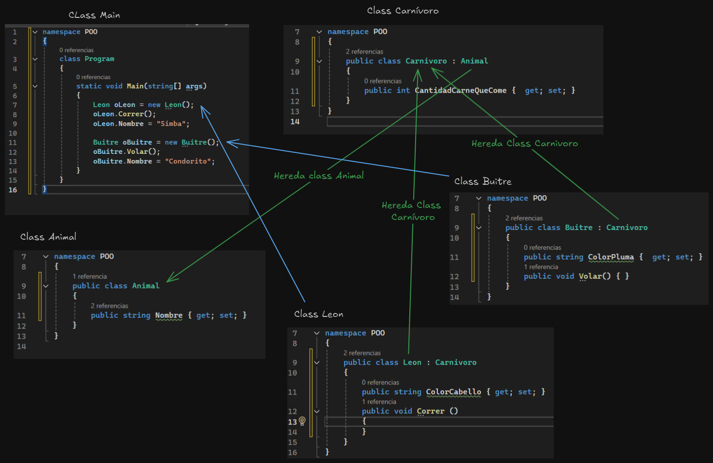

## C# (C Sharp)
>**[Documentación](https://learn.microsoft.com/es-es/dotnet/csharp/tour-of-csharp/)**
## Mostrar mensaje por pantalla
```cs
Console.WriteLine("Hola mi primer codigo"+"\n"+"C Shart");
```

## Tipos de Datos y Operadores
### Tipos de datos básicos
- int
- String
- float
- double
- bool
- boolean

```cs
// Ejemplo
int a = 2;
int b = 5;
int c = a + b;
String texto = "El resultado es: ";

Console.WriteLine(texto + c); // + concatena los variables y también sirve para sumar
```
> **Variables:** Las variables actúan como contenedores de datos que pueden cambiar durante la ejecución de un programa.

> **Constantes:** Las constantes son valores fijos que no cambian una vez definido y se utilizan para valores que no deben modificarse durante la ejecución del programa. _Ejemplo: Números de Dias de una semana, siempre sera 7._

### Operadores aritméticos, lógicos y relacionales
- Operadores aritméticos:
```cs
int suma = 3 + 5;
int resta = 5 - 1;
int mult = 2 * 2;
float div = 10 / 2;
float residuo = 10 % 2;

Console.WriteLine("Suma: "+ suma);
Console.WriteLine("Resta: "+ resta);
Console.WriteLine("Multiplicación: " + mult);
Console.WriteLine("Division: " + div);
Console.WriteLine("Residuo: " + residuo);
```

- Operadores de Incrementos y Decrementos
```cs
a++; // Incrementos
a--; // Decrementos
a+=2; // Incrementa en 2
a-=2; // Decrementa en 2
```

- Operadores lógicos:
    - ``&`` (AND)
    - ``&&`` (AND de cortocircuito)
    - ``|`` (OR)
    - ``||`` (AND de cortocircuito)
    - ``^`` (XOR)

- Operadores relacionales:
    - ``<`` (Menor que)
    - ``<=`` (Menor o igual que)
    - ``>`` (mayor que)
    - ``>=`` (Mayor o igual que)
    - ``==`` (Igual que)
    - ``!=`` (Distinto que)

## Estructuras de Control
### Condicionales (if, else, else if)
```cs
int x, y;

Console.WriteLine("Ingrese el primer numero:");
x = int.Parse(Console.ReadLine()); // Ingresa por teclado el valor
Console.WriteLine("Ingrese el segundo numero:");
y = int.Parse(Console.ReadLine()); // Ingresa por teclado el valor

if (x >= y)
{
    Console.WriteLine(x + " Es mayor");
}
else
{
    Console.WriteLine(x + " Es menor");
}
```
### Switch
```cs

int dia;
Console.WriteLine("Ingrese un numero para saber el dia:");
dia = int.Parse(Console.ReadLine());

switch (dia)
{
    case 1:
        Console.WriteLine("Lunes");
        break;
    case 2:
        Console.WriteLine("Martes");
        break;
    case 3:
        Console.WriteLine("Miercoles");
        break;
    case 4:
        Console.WriteLine("Jueves");
        break;
    case 5:
        Console.WriteLine("Viernes");
        break;
    case 6:
        Console.WriteLine("Sabado");
        break;
    case 7:
        Console.WriteLine("Domingo");
        break;
    default:
        Console.WriteLine("Esta semana no existe");
        break;
}
```
### Bucles (for, while, do-while)
```cs
int num;
Console.WriteLine("Ingrese la tabla de multiplicar: ");
num = int.Parse(Console.ReadLine());

// Condicional FOR
for (int i = 1; i <= 12; i++)
{ 
    Console.WriteLine( num +"X"+ i +"="+ num*i);
}
```
```cs
// Condicional WHILE
int x = 1;
while (x <= 12)
{
    Console.WriteLine(x);
    x++;
}
```
```cs
// Condicional Do-While
int x = 1;
do
{
    Console.WriteLine(x);
    x++;
}
while (x <= 12);
```

### Operadores ternarios
```cs
int edad = 21;
Console.WriteLine(edad > 18 ? "Es mayor de edad" : "Es menor de edad");
```

## Programación Orientada a Objetos (POO)
### Clases y objetos
```cs
class Geometria
{
    static void Main()
    {
        FigurasGeometricas figuras = new FigurasGeometricas();
        double circulo = figuras.AreaCirculo(12);
        double cuadrado = figuras.AreaCuadrado(12);

        Console.WriteLine("Area del circulo es: "+ circulo);
        Console.WriteLine("Area del cuadrado es: "+ cuadrado);
    }

    class FigurasGeometricas
    {
        double pi = Math.PI;
        double lado;

        public double AreaCirculo(double radio)
        {
            double area = pi * radio * radio;
            return area;
        }

        public double AreaCuadrado(double lado)
        {
            double area = lado * lado;
            return area;
        }
    }
}
```

### Definición de métodos
> Un método es un bloque de código que contiene una serie de instrucciones. Un programa hace que se ejecuten las instrucciones al llamar al método y especificando los argumentos de método necesarios. En C#, todas las instrucciones ejecutadas se realizan en el contexto de un método.

### Métodos
```cs
class Operaciones
{
    static void Main()
    {
        Operaciones operaciones = new Operaciones();
        operaciones.Suma();
        operaciones.MostrarResta();
        operaciones.MostrarMult();
        operaciones.MostrarDiv();
    }

    // Método que no retorna un valor y sin parámetro
    public void Suma()
    {
        int suma = 2 + 3;
        Console.WriteLine("Suma: "+suma);
    }

    // Metodo que retorna un valor pero sin parámetro
    public int Resta()
    {
       int resta = 10 - 5 ;
        return resta; //Valor de retorno
    }

    public void MostrarResta()
    {   
        int resta = Resta();
        Console.WriteLine("Resta: "+resta);
    }

    //Metodo que no retorna valor pero tiene parámetro
    public void Multiplicacion(int a, int b)
    {
        Console.WriteLine("Multiplicación: "+ a * b);
    }

    public void MostrarMult()
    {
        int nun1 = 3;
        int nun2 = 5;
        Multiplicacion(nun1, nun2); //(argumento)
    }

    //Método que retorna valor y tiene parámetros
    public double Division(double a, double b)
    {
        double div = a / b;
        return div; //Valor de retorno
    }

    public  void MostrarDiv()
    {
        double num1 = 3;
        double num2 = 5;
        double div = Division(num1, num2);
        Console.WriteLine("Division: "+div);
    }
}
```

### Herencia
> Las hererencias en C# se declaran con ```:``` 


### Sobrecarga
> Sobrecarga: creación de varios métodos con el mismo nombre pero con diferentes definiciones o parámetros. También se puede realizar sobrecargas a Constructores
```cs
namespace POO
{
    public class Leon : Carnivoro
    {
        // Constructor con valor por defecto
        public Leon() { //Constructor padre
            if (this.Nombre == null || !this.Nombre.Equals(""))
            {
                this.Nombre = "Leon";
            }
            Console.WriteLine("Carga de datos");
        }

        // Constructor con valor por parametro
        public Leon(string Nombre) : this() //this() permite ejecutar primero el constuctor padre
        {
            this.Nombre = Nombre;
        }

        public string ColorCabello { get; set; }

        private int velocidadDefecto = 4;
        // Metodo Correr con valor por defecto
        public void Correr () 
        {
            Console.WriteLine(velocidadDefecto+"Km/hr");
        }

        // Metodo Correr con parametro int
        public void Correr(int velocidad) {
            Console.WriteLine("Corriendo a "+velocidad+"Km/hr");
        }

        // Metodo Correr con parametro string
        public void Correr(string presa)
        {
            Console.WriteLine("Corriendo a cazar: " + presa);
        }
    }
}
```

### Sobrescitura 
> La sobrescritura es ocultar un método por otro que lo reemplaza, es decir define ese mismo método nuevamente.
```cs
namespace POO
{
    class Program
    {
        static void Main(string[] args)
        {
            Leon oLeon = new Leon("Simba");
            // Mostrar el valor sobrescrito
            Console.WriteLine(oLeon.GetNombre());
        }
    }
}
```

```cs
namespace POO
{
    public class Animal
    {
        public string Nombre { get; set; }

        // Sobrescitura
        public virtual string GetNombre() { 
            return Nombre;
        }
    }
}
```

```cs
namespace POO
{
    public class Leon : Carnivoro
    {
        // Sobrescitura
        public override string GetNombre()
        {
            return "Soy un león llamado: "+ Nombre;
        }
    }
}
```

### Encapsulación
> La encapsulacion esta implementada por modificadores de acceso y estos seran los encargados de definir el rango y la visibilidad de los miembros de la clase, veamos los disponibles:

- **public**: nos permitira exponer todos los miembros que definamos de esta manera, estos pueden ser tanto metodos (funciones) como propiedades (variables) dentro de las clases y las mismas podran ser accedidas desde afuera de la misma.

- **private**: permite denegar el acceso a las propiedades y metodos desde otros objetos o clases, y estos elementos solo pueden ser accedidos por miembros dentro de la misma clase, inclusive una instancia de la misma clase no podria acceder.

- **protected**: es mas utilizado para cuando tenemos clases heredadas, dado que trabaja como public para las clase hijas de la clase base y como private para las clases externas a la misma.

- **internal**: es el predeterminado cuando no informamos ninguno, este nos permite al igual que public exponer todos los metodos y propiedades de la clase dentro del mismo ensamblado (assembly), es decir que todas las clases podran tener acceso siempre y cuando esten dentro del mismo ensamblado.

- **protected internal**: es una mezcla entre el internal y el protected, porque ocultara a los miembros a las clases externas de esta pero si le permitira el acceso a las hijas de la clase base.

### Propiedades
> Permiten que una clase exponga una manera pública de obtener y establecer valores, a la vez que se oculta el código de implementación o verificación.

- **``get``**
- **``set``**

> Permiten **obtener** (``get``) o **establecer** (``set``) el valor de una variable desde fuera de la clase, manteniendo así el encapsulamiento y controlando el acceso a los datos internos de la clase.

```cs
namespace POO
{
    public class Leon : Carnivoro
    {
        private int velocidadDefecto = 4;
        public int Velocidad
        {   // Muestra e valor
            get { return velocidadDefecto; }
            // Modifica el valor
            set { 
                if(value < 0)
                    value = 1;
                velocidadDefecto = value; 
            }
        }
    }
}
```

### Polimorfismo
>  El polimorfismo está íntimamente relacionado con la ``sobrecarga`` y la ``sobrescritura``.

> **Polimorfismo de Inclusion:** La habilidad para redefinir por completo el método de una superclase en una subclase.

- **Polimorfismo de Inclusion:**
```cs
//CLass Main
namespace Polimorfismo
{
    class Program
    {
        static void Main(string[] args)
        {
            Bar oBar = new Bar();
            Persona oMesero = new Mesero("Carlos");
            Persona oCantinero = new Cantinero("Hector");
            Persona oCliente = new Cliente("Maria");
            oBar.Entrar(oMesero);
            oBar.Entrar(oCantinero);
            oBar.Entrar(oCliente);
        }
    }
}
```
```cs
// CLass Persona
namespace Polimorfismo
{
     class Persona
    {
        public string Nombre { get; set; }

        public Persona(string Nombre) { this.Nombre = Nombre; }

        public virtual void Accion() { }
    }
}
```
```cs
// Class Bar
namespace Polimorfismo
{
    class Bar
    {
        List<Persona> listPersona = new List<Persona>();

        public void Entrar(Persona oPersona)
        {
            listPersona.Add(oPersona);
            oPersona.Accion();
        }
    }
}
```
```cs
// Class Mesero
namespace Polimorfismo
{
    class Mesero : Persona
    {
        public Mesero(string Nombre) : base(Nombre) {}

        public override void Accion()
        {
            Console.WriteLine("Atiende mesas");
        }

    }
}
```
```cs
// Class Cliente
namespace Polimorfismo
{
    internal class Cliente : Persona
    {
        public Cliente(string Nombre) : base(Nombre) { }

        public override void Accion()
        {
            Console.WriteLine("Tomar bebidas");
        }
    }
}
```
```cs
// Class Persona
namespace Polimorfismo
{
    class Cantinero : Persona
    {   
        public Cantinero(string Nombre) : base(Nombre) { }

           public override void Accion()
        {
            Console.WriteLine("Realiza bebitas");
        }

    }

}
```

### Constructores
```cs
namespace AbstractasInterfaces
{
class Program
    {
    static void Main(string[] args)
    {
        Persona oPesona1 = new Persona("Ivan", 28);
        Persona oPesona2 = new Persona("Luis", 29);

        Console.WriteLine(oPesona1.MostrarDatos());
        Console.WriteLine(oPesona2.MostrarDatos());
    }
    
    }
}
```
```cs
namespace AbstractasInterfaces
{
    internal class Persona
    {
        public string Nombre;
        public int Edad;

        // Constructor de la clase Persona
        public Persona(string name, int age) 
        {
            Nombre = name;
            Edad = age;
        }

        public string MostrarDatos()
        {
            return $"Mi nombre es '{Nombre}' tengo {Edad} años.";
        }
    }
}
```

### Clases abstractas e interfaces
```cs

```


## Tipos Avanzados
### Enumeraciones (enum)
### Estructuras (struct)
### Delegados y eventos
### Expresiones lambda

## Manejo de Excepciones
### Try, catch, finally
### Throw y creación de excepciones personalizadas

## Colecciones y Genéricos
### Arrays
### Listas y Diccionarios
### Pilas (Stack) y colas (Queue)
### Genéricos (List<T>, Dictionary<T, T>)

## LINQ (Language-Integrated Query)
### Sintaxis básica de LINQ
### Consultas de selección, filtrado y agrupación
### Uso de métodos como `Select()`, `Where()`, `GroupBy()`

## Manejo de Archivos
### Lectura y escritura en archivos
### Streams (FileStream, StreamReader, StreamWriter)

## Conceptos Avanzados
### Tareas asíncronas (async/await)
### Expresiones regulares
### Serialización de objetos