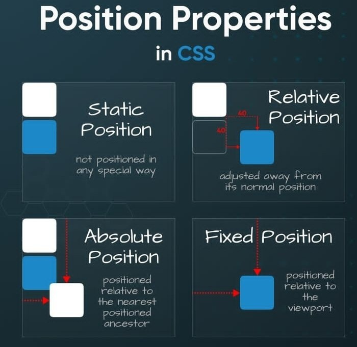

<p align="center"><a href="https://developer.mozilla.org/es/docs/Web/CSS" target="_blank"></a></p>

# Cheat Sheet

## Selectores

- `*` Selector Universal
- `#id` Selector de ID
- `.class` Selector de Clase
- `h1, h2` Selector de Tipo
- `h1+p` Selector de Hermanos Adyacentes
- `ul > li` Selector de Hijo
- `h1 ~ p` Selector de Hermanos Generales
- `p a` Selector de Descendientes
- `div[att="val"]` Selector de Atributo

## Unidades

- `%` Porcentaje
- `cm` Centímetro
- `in` Pulgada
- `mm` Milímetro
- `pc` Pica (1 pica = 12 puntos)
- `pt` Punto (1 punto = 1/72 de pulgada)
- `px` Pixel (1 pixel = 1/96 de pulgada)
- `ch` Ancho del glifo "0" en el tamaño de fuente
- `em` 1em = Tamaño de fuente actual
- `ex` Altura x de la fuente del elemento
- `gd` Cuadrícula definida por 'layout-grid'
- `rem` Tamaño de fuente del elemento raíz
- `vh` Altura de la ventana gráfica
- `vw` Ancho de la ventana gráfica
- `vm` Menor de la altura o anchura de la ventana gráfica

---

## Selectores Pseudo

| Selector | Descripción |
| --- | --- |
| `:active` | Elemento activado |
| `:focus` | Elemento enfocado |
| `:hover` | Elemento sobre el que se pasa el ratón |
| `:link` | Enlace no visitado |
| `:disabled` | Elemento deshabilitado |
| `:enabled` | Elemento habilitado |
| `:checked` | Elemento marcado |
| `:nth-child(n)` | Enésimo hermano |
| `:nth-last-child(n)` | Enésimo hermano desde el final |
| `:first-child` | Primer hermano |
| `:last-child` | Último hermano |
| `:only-child` | Único hijo |
| `:nth-of-type(n)` | Enésimo hermano de su tipo |
| `:nth-last-of-type(n)` | Enésimo hermano de su tipo desde el final |
| `:last-of-type` | Último hermano de su tipo |
| `:first-of-type` | Primer hermano de su tipo |
| `:only-of-type` | Único hijo de su tipo |
| `:empty` | Elemento sin hijos |
| `:root` | Elemento raíz |
| `:not(x)` | Elemento que no coincide con 'x' |
| `:target` | Elemento objetivo especificado por un URI |
| `:first-letter` | Estilo para la primera letra del texto |
| `:first-line` | Estilo para la primera línea del texto |
| `:before` | Insertar contenido antes de un elemento |
| `:after` | Insertar contenido después de un elemento |

---

## Estilo de Listas

- **Tipo de Lista**: `list-style-type: disc | circle | square | none;`
- **Posición de la Lista**: `list-style-position: inside | outside;`
- **Imagen de la Lista**: `list-style-image: url()`

## Posición

- **Posición**: `position: static | relative | absolute | fixed | sticky;`
- **Posición del Elemento**: `top | right | bottom | left`
- **Flotar Elemento**: `float: left | right | none`
- **Z-index**: `z-index: 3 | auto | none`
- **Limpiar Flotación**: `clear: none | left | right | both`

---

## Fondo

- **Color de Fondo**: `background-color:#FFF2EB`
- **Imagen de Fondo**: `background-image: url()`
- **Repetición de Fondo**: `background-repeat: repeat-x | repeat-y | repeat | space | round | no-repeat`
- **Adjunto de Fondo**: `background-attachment: scroll | fixed | local | initial | inherit`
- **Posición de Fondo**: `background-position: top | right | bottom | left | center`

## Propiedades de Fuente

- **Estilo de Fuente**: `font-style: normal | italic | oblique`
- **Variante de Fuente**: `font-variant: normal | small-caps`
- **Tamaño de Fuente**: `font-size: 13px | 0.8rem | 80%`
- **Peso de Fuente**: `font-weight: normal | bold | bolder | lighter | 100-900`
- **Espaciado de Letras**: `letter-spacing: normal | 4px`
- **Altura de Línea**: `line-height: normal | 3rem | 34%`
- **Familia de Fuente**: `font-family: 'Open sans', sans-serif`

---

## Propiedades de Texto

- **Alineación de Texto**: `text-align: left | right | center | justify`
- **Transformación de Texto**: `text-transform: capitalize | lowercase | uppercase`
- **Sangría de Texto**: `text-indent: 23px`
- **Alineación Vertical**: `vertical-align: baseline | 18px | sub | super | top | text-top | middle | bottom | text-bottom | initial`
- **Alineación de Última Línea**: `text-align-last: auto | left | right | center | justify | start | end | initial | inherit`
- **Decoración de Texto**: `text-decoration: none | underline | overline | line-through`
- **Justificación de Texto**: `text-justify: auto | inter-word | inter-character | none | initial | inherit`
- **Desbordamiento de Texto**: `text-overflow: clip | ellipsis | string | initial | inherit`
- **Sombra de Texto**: `text-shadow: h-shadow v-shadow | blur-radius color | none | initial | inherit`

---

## Dark Mode Nativo

### Media query (prefers-color-scheme)
```css
/* Estilos por defecto (modo claro) */
body {
    background-color: white;
    color: black;
}

/* Estilos para el modo oscuro */
@media (prefers-color-scheme: dark) {
    body {
        background-color: black;
        color: white;
    }
}
```

### color-scheme
> La propiedad ``color-scheme`` permite indicar al navegador qué esquemas de color (claro u oscuro) soporta tu página. Esto afecta a los elementos del sistema como los controles de formulario, barras de desplazamiento, etc.

```css
/* Aplicar color-scheme basado en las preferencias del sistema */
:root {
    color-scheme: light dark;
}
```

### light-dark()
> La función ``light-dark()`` es una función experimental (aún no soportada en todos los navegadores) que permite definir valores diferentes para los modos claro y oscuro de manera sencilla.
```css
/* Definir colores para modo claro y oscuro */
body {
    background-color: light-dark(white, black);
    color: light-dark(black, white);
}
```

### Consideraciones

| Característica           | Soporte en Navegadores | Recomendación de Uso |
|--------------------------|------------------------|----------------------|
| `prefers-color-scheme`   | Amplio (Chrome, Firefox, Safari, Edge, Opera) | **Mejor opción** para temas claros/oscuros. |
| `color-scheme`           | Amplio (Chrome, Firefox, Safari, Edge, Opera) | Útil para elementos del sistema. Combínalo con `prefers-color-scheme`. |
| `light-dark()`           | Muy limitado (ningún navegador importante lo soporta) | **No recomendado** para producción. Usa `prefers-color-scheme` como alternativa. |

En resumen, **`prefers-color-scheme`** es la mejor opción para implementar temas claros y oscuros en la mayoría de los navegadores modernos, mientras que `color-scheme` es un buen complemento para asegurar que los elementos del sistema se adapten correctamente. Evita usar `light-dark()` hasta que tenga un soporte más amplio.

- **Compatibilidad**: La función ``light-dark()`` es experimental y no está soportada en todos los navegadores. Asegúrate de verificar la compatibilidad antes de usarla en producción.

- **Fallback**: Si necesitas soportar navegadores que no admiten ``light-dark()``, puedes usar media queries como alternativa:

## Escribe Mejor Código de CSS


## Explicación de Propiedades





