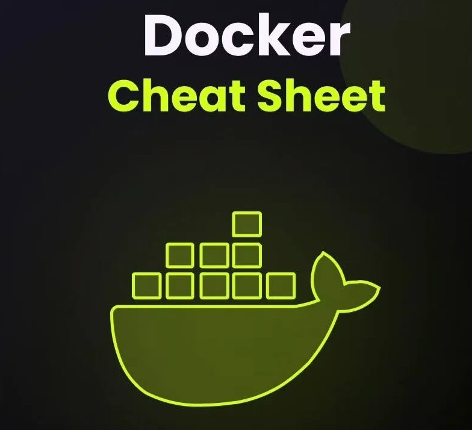
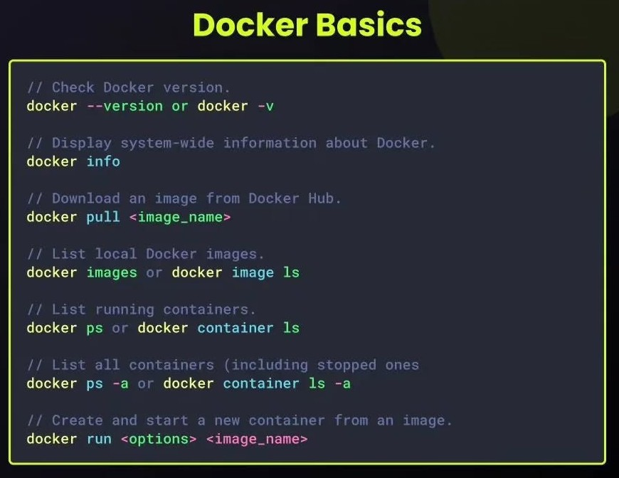
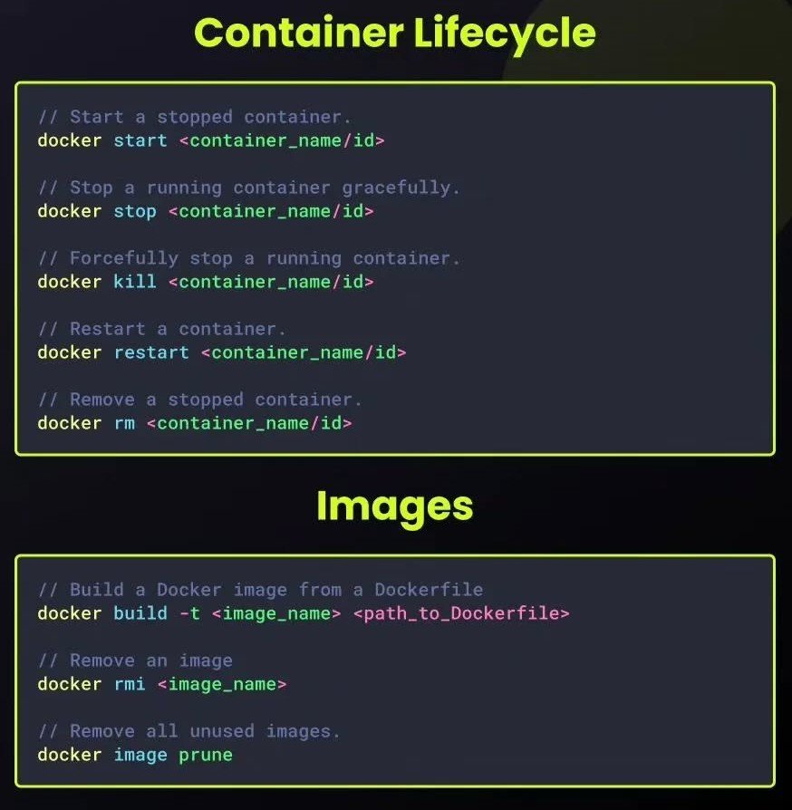
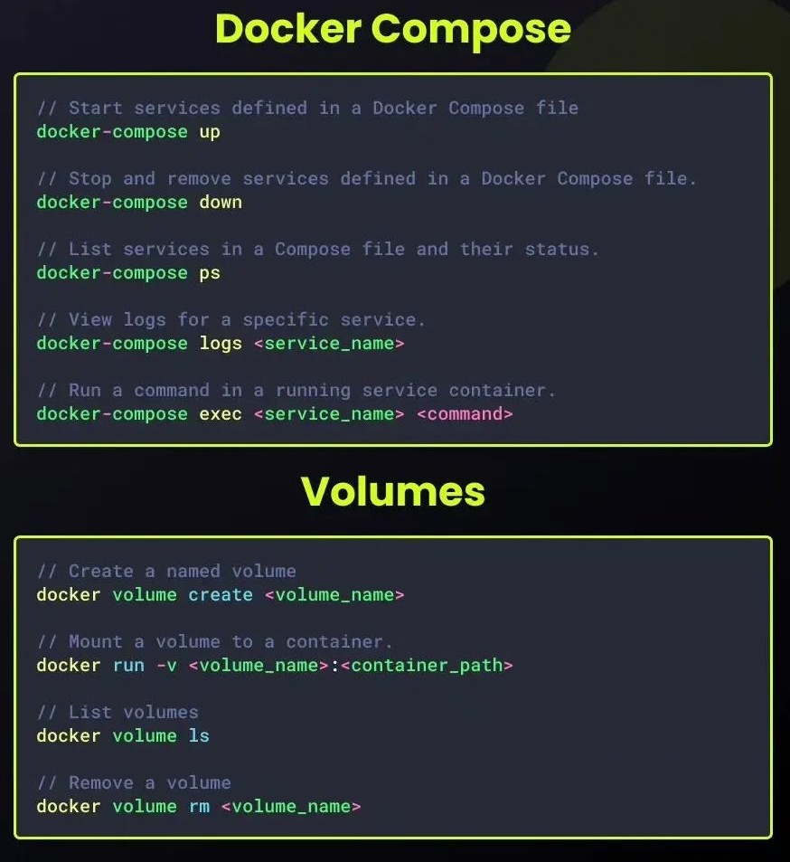
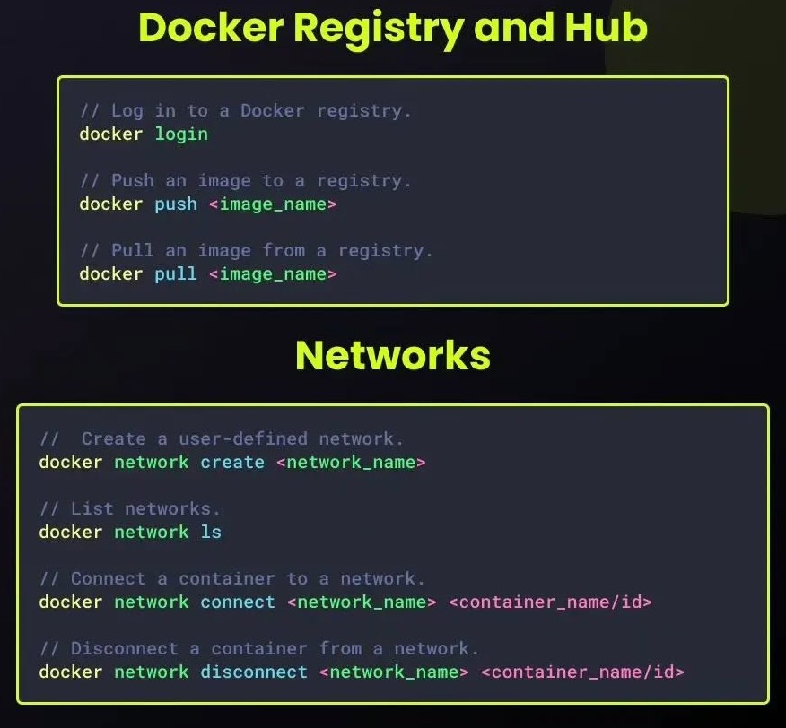
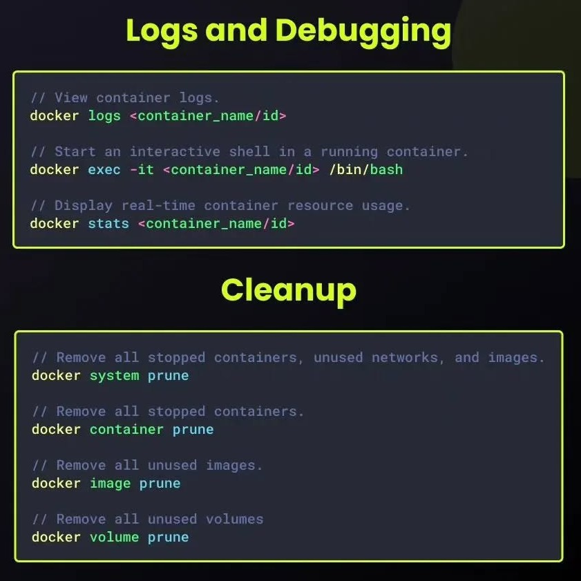

# Docker

## Introducción
### ¿Qué es un contenedor?
Un contenedor es una unidad de software que encapsula una aplicación y todas sus dependencias en un entorno aislado. Proporciona una forma de empaquetar, distribuir y ejecutar aplicaciones de manera consistente en diferentes entornos, ya sea en un entorno de desarrollo, pruebas o producción.

### Contenedores vs. máquinas virtuales
Los contenedores y las máquinas virtuales (VMs) son tecnologías de virtualización que permiten ejecutar múltiples aplicaciones en un mismo servidor físico. Sin embargo, existen diferencias significativas entre ambas tecnologías en términos de arquitectura, rendimiento y uso de recursos.


Las máquinas virtuales emulan un hardware completo, incluido un sistema operativo, una capa de virtualización y una aplicación. Cada VM se ejecuta en su propio hipervisor, que administra los recursos físicos del servidor y proporciona aislamiento entre las VMs. Esto permite que las VMs sean independientes y portátiles, pero también consume más recursos y es menos eficiente que los contenedores.

Los contenedores, por otro lado, comparten el mismo kernel del sistema operativo subyacente y se ejecutan en un entorno aislado, pero comparten los recursos del sistema, como la CPU, la memoria y el almacenamiento. Esto hace que los contenedores sean más ligeros y rápidos que las VMs, ya que no tienen la sobrecarga de un sistema operativo completo y una capa de virtualización adicional.

### Estandarización de los contenedores
Los contenedores se han convertido en una parte fundamental de la infraestructura de TI moderna, ya que ofrecen una forma eficiente y flexible de implementar aplicaciones en entornos de desarrollo, pruebas y producción. Para garantizar la interoperabilidad y la portabilidad de los contenedores, se han desarrollado estándares y especificaciones que definen cómo deben funcionar los contenedores y cómo deben interactuar entre sí.

### Casos de uso de los contenedores
Los contenedores se pueden utilizar en infinidad de casos. Algunos de los casos de uso más comunes de los contenedores incluyen:

- Desarrollo y pruebas de aplicaciones
- Implementación de microservicios
- Implementación de aplicaciones en la nube
- CI/CD (Continuous Integration/Continuous Deployment)
- Aislamiento de aplicaciones
- Escalabilidad y alta disponibilidad
- Desarrollo multiplataforma

### Política de reinicio
Por defecto, cuando un contenedor falla o termina su proceso, Docker no lo reinicia por defecto. Si queremos que un contenedor se reinicie automáticamente, podemos utilizar la opción --restart. Esta opción nos permite definir una política de reinicio. Algunas de las políticas más comunes son:

- ``no``: No reinicia el contenedor.
- ``always``: Reinicia el contenedor siempre.
- ``unless-stopped``: Reinicia el contenedor siempre que no lo paremos.
- ``on-failure``: Reinicia el contenedor solo si falla.
- ``on-failure:<n>``: Reinicia el contenedor solo si falla n veces.

### Dockerfile
Un Dockerfile se compone de una serie de instrucciones, cada una de ellas en una línea diferente. Las instrucciones más comunes son:
- ``FROM``: Indica la imagen base que se utilizará para construir la nueva imagen.
- ``RUN``: Ejecuta comandos en la imagen.
- ``COPY``: Copia archivos o directorios desde el host a la imagen.
- ``WORKDIR``: Establece el directorio de trabajo por defecto para el resto de instrucciones.
- ``CMD``: Define el comando que se ejecutará cuando se inicie un contenedor a partir de la imagen.
- ``ENTRYPOINT``: Define el comando que se ejecutará cuando se inicie un contenedor a partir de la imagen, pero no se puede sobreescribir.


### Los tipos de redes más comunes que podemos crear:
- ``bridge``: Red por defecto, que permite la comunicación entre contenedores en el mismo host.
- ``host``: Red que permite que los contenedores compartan la red del host (ojo con la seguridad, porque los contenedores pueden ver la red del host anfitrión).
- ``overlay``: Red que permite la comunicación entre contenedores en diferentes hosts.
- ``macvlan``: Red que permite asignar una dirección MAC a un contenedor y que se comporte como un dispositivo físico en la red.
- ``none``: Sin red, el contenedor no tendrá acceso a la red.

Lo más común es usar el driver ``bridge`` para la mayoría de los casos, aunque para cargas distribuidas, podemos usar el driver ``overlay``.

## Comandos de Docker

### Gestión de Imágenes
Iniciar una imagen
```bash
docker run [nombre_imagen]
```
- **Opciones comunes de ``docker run``:**
    - `` -d``: Arranca el contenedor en segundo plano.
    - ``-p``: Mapea un puerto del contenedor al puerto del host.
    - ``-v``: Mapea un volumen del host al contenedor.
    - ``--name``: Asigna un nombre al contenedor.
    - ``--rm``: Elimina el contenedor al pararlo.
    - ``-e``: Define una variable de entorno.
    - ``--env-file``: Define un archivo de variables de entorno.


Descarga una imagen específica desde un registro.
```bash
docker pull [nombre_imagen]:[tag]
```

Lista todas las imágenes locales.
```bash
docker images
```

Elimina una imagen.
```bash
docker rmi [id_imagen] o [nombre_imagen]:[tag]
```

Construye una imagen a partir de un Dockerfile en el directorio actual.
```bash
docker build -t [nombre_imagen]:[tag] .
```

Envía una imagen a un registro.
```bash
docker push [nombre_imagen]:[tag]
```

### Gestión de Contenedores
Lista los contenedores en ejecución.
```bash
docker ps
```

Lista todos los contenedores, incluyendo los detenidos.
```bash
docker ps -a
```

Inicia un contenedor detenido.
```bash
docker start [id_contenedor]
```

Detiene un contenedor.
```bash
docker stop [id_contenedor]
```

Ejecuta un comando dentro de un contenedor interactivo.
```bash
docker restart [id_contenedor]
```
```bash
docker rm [id_contenedor]
```
```bash
docker exec -it [id_contenedor] /bin/bash
```

Muestra detalles sobre un contenedor.
```bash
docker inspect [id_contenedor]
```

Muestra los logs de un contenedor.
```bash
docker logs [id_contenedor]
```

### Gestión de Redes
Crea una nueva red.
```bash
docker network create [nombre_red]
```

Lista las redes existentes.
```bash
docker network ls
```

Conecta un contenedor a una red.
```bash
docker network connect [nombre_red] [id_contenedor]
```

### Gestión de Volúmenes
Crea un nuevo volumen.
```bash
docker volume create [nombre_volumen]
```

Lista los volúmenes.
```bash
docker volume ls
```

Elimina un volumen.
```bash
docker volume rm [nombre_volumen]
```

### Otros Comandos Útiles
Introducir usuario en el grupo docker
```bash
sudo usermod -a -G docker [nombre_usuario]
```

Refrescar grupo sin tener que reiniciar
```bash
newgrp docker
```

Busca imágenes en un registro.
```bash
docker search [término_de_búsqueda]
```

Muestra el uso del disco de Docker.
```bash
docker system df
```

Elimina contenedores no utilizados, redes no conectadas y volúmenes noilizados.
```bash
docker system prune
```

### Comandos de Docker Compose
Levanta todos los servicios en segundo plano.
```bash
docker compose up -d
```

Detiene y elimina todos los servicios.
```bash
docker compose down
```

Muestra el estado de los servicios.
```bash
docker compose ps
```

Muestra los logs de los servicios en tiempo real.
```bash
docker compose logs -f
```

Escala el número de réplicas de un servicio.
```bash
docker compose scale <servicio>=<número>
```

**Consejos:**
* **Completa la documentación:** Consulta la documentación oficial de Docker para obtener información más detallada y ejemplos.
* **Utiliza alias:** Crea alias para comandos largos para agilizar tu trabajo.
* **Explora las opciones:** Cada comando tiene numerosas opciones que te permiten personalizar su comportamiento.
* **Practica regularmente:** La mejor manera de aprender Docker es practicando con diferentes escenarios.

## Cheat Sheet






