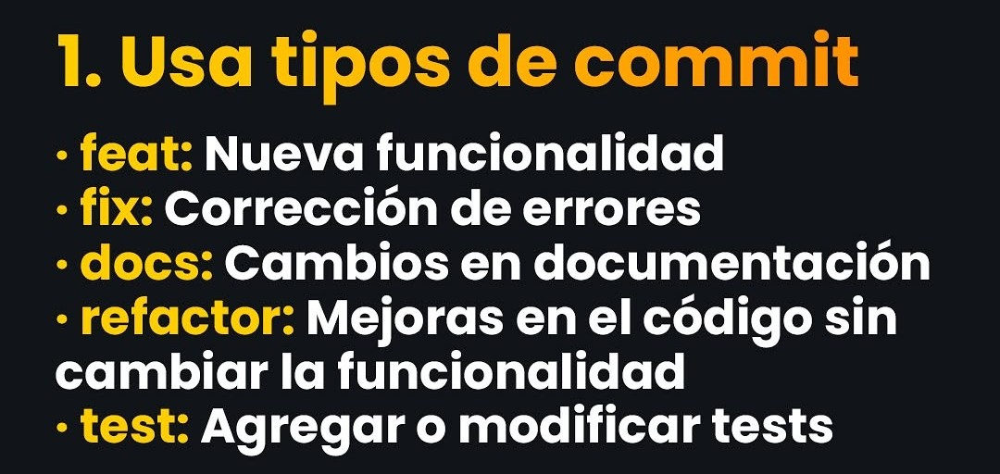
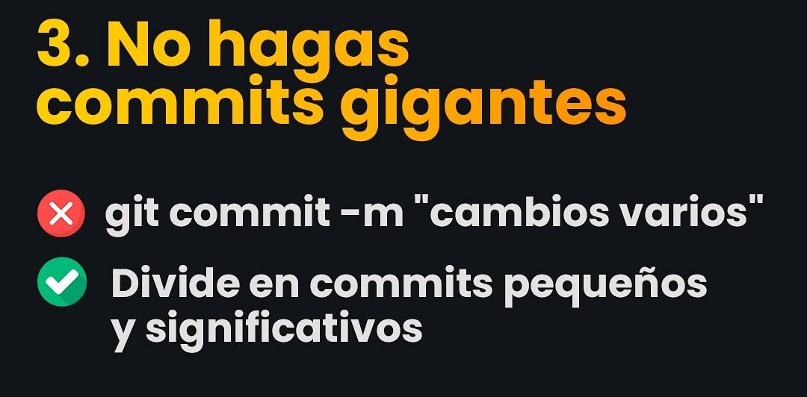
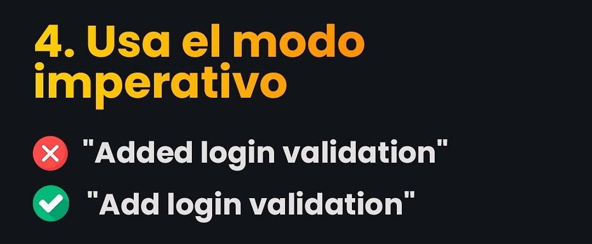
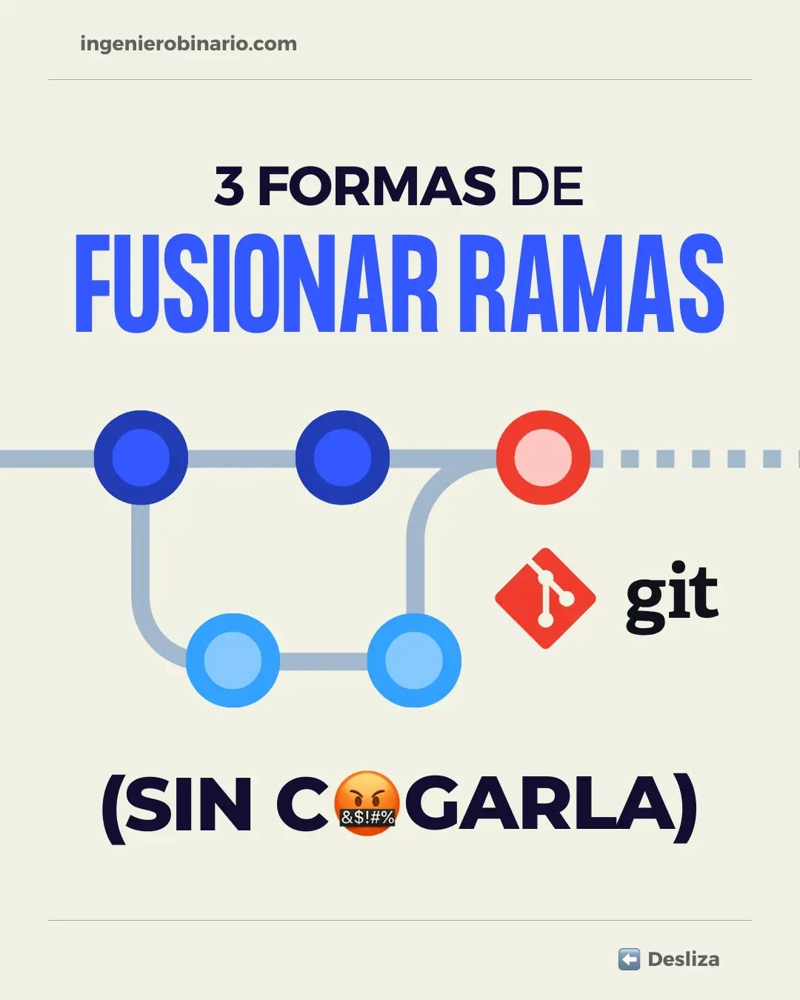
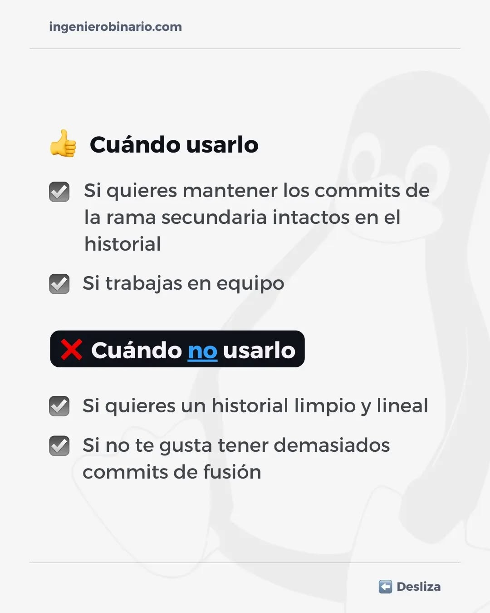
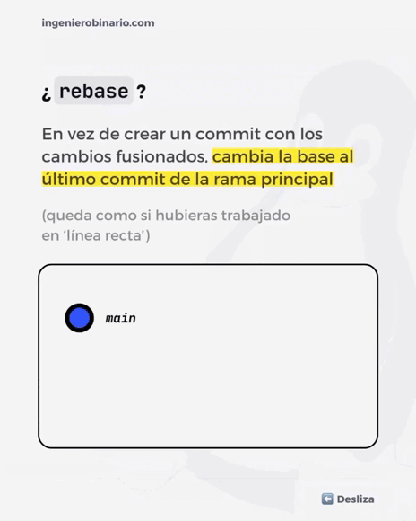

# GIT
<p align="center"><a href="https://git-scm.com/doc" target="_blank"></a></p>

Claro, aquí tienes los comandos de Git con una descripción de su función y dentro de bloques de código `bash`:

## **Configuración Inicial**

* Configura el nombre de usuario global para Git.
```bash
git config --global user.name "Ivaniel-Dz"
```

* Configura el correo electrónico global para Git.
```bash
git config --global user.email pcivaniel@gmail.com
```

* Configura el editor de texto predeterminado para Git (en este caso, Visual Studio Code).
```bash
git config --global core.editor "code --wait"
```

* Abre el archivo de configuración global de Git en el editor de texto.
```bash
git config --global -e
```

* Configura Git para manejar correctamente los finales de línea en diferentes sistemas operativos.
```bash
git config --global core.autocrlf true
```

## **Subir Proyecto a Repositorio GitHub**

* Inicializa un nuevo repositorio Git en el directorio actual.
```bash
git init
```

* Muestra el estado actual del repositorio (archivos modificados, etc.).
```bash
git status
```
* Muestra el estado actual del repositorio en formato abreviado.
```bash
git status -s
```

* Agrega un archivo específico al área de preparación (staging area).
```bash
git add nombre_de_archivo.extension
```
* Agrega todos los archivos modificados y nuevos al área de preparación.
```bash
git add .
```

* Crea un nuevo commit con un mensaje descriptivo.
```bash
git commit -m "first commit"
```

* Cambia el nombre de la rama principal a "main".
```bash
git branch -M main
```

* Agrega un nuevo repositorio remoto con el nombre "origin" y la URL especificada.
```bash
git remote add origin https://github.com/Ivaniel-Dz/repository-name.git
```

* Envía los commits locales a la rama "main" del repositorio remoto "origin".
```bash
git push -u origin main
```
* Envía los commits locales a la rama "main" del repositorio remoto "origin".
```bash
git push origin main
```

## **Actualizaciones de Cambios Locales a GitHub**

* Muestra el estado actual del repositorio.
```bash
git status
```

* Agrega todos los archivos modificados y nuevos al área de preparación.
```bash
git add .
```

* Crea un nuevo commit con un mensaje descriptivo.
```bash
git commit -m "Mensaje"
```

* Envía los commits locales a la rama "main" del repositorio remoto "origin".
```bash
git push -u origin main
```

## **Otros Comandos**

* Muestra el historial de commits.
```bash
git log
```
* Muestra el historial de commits en formato de una línea.
```bash
git log --oneline
```

### **No Subir Archivos Específicos**

* Crea un archivo `.gitignore` y agrega los patrones de archivos que no se deben subir (por ejemplo, `.class`, `.jpg`).

### **Bajar o Clonar Repositorios desde GitHub**

* Clona un repositorio remoto en el directorio actual.
```bash
git clone https://...
```

### **Actualizar Rama Local**

* Descarga los cambios del repositorio remoto y los fusiona con la rama local actual.
```bash
git pull
```

### **Borrar .git**

* Elimina el directorio `.git` (convirtiendo el directorio actual en un directorio normal).
```bash
rm -rf .git
```

### **Comandos de Git Sin Configuración Inicial**

* Inicializa un nuevo repositorio Git en el directorio actual.
```bash
git init
```

* Muestra el estado actual del repositorio.
```bash
git status
```
* Muestra el estado actual del repositorio en formato abreviado.
```bash
git status -s
```

* Agrega un archivo específico al área de preparación.
```bash
git add nombre_de_archivo.extension
```
* Agrega todos los archivos modificados y nuevos al área de preparación.
```bash
git add .
```

* Crea un nuevo commit con un mensaje descriptivo.
```bash
git commit -m "Mensaje"
```

* Configura el correo electrónico global para Git.
```bash
git config --global user.email pcivaniel@gmail.com
```

* Configura el nombre de usuario global para Git.
```bash
git config --global user.name Ivaniel-Dz
```

* Crea un nuevo commit (sin mensaje en la línea de comandos).
```bash
git commit
```

* Cambia el nombre de la rama principal a "main".
```bash
git branch -M main
```

* Agrega un nuevo repositorio remoto con el nombre "origin" y la URL especificada.
```bash
git remote add origin https://github.com/Ivaniel-Dz/repository-name.git
```

* Crea un commit inicial (si el siguiente paso falla).
```bash
git commit -m "initial commit"
```

* Envía los commits locales a la rama "main" del repositorio remoto "origin".
```bash
git push -u origin main
```
* Envía los commits locales a la rama "main" del repositorio remoto "origin".
```bash
git push origin main
```

## Guía para escribir mejores commits







### Funcionar Ramas






## Cheat Sheet

### **Crear y Clonar Repositorios**
1. **Inicializar un repositorio**  
   ```bash
   git init
   ```
2. **Clonar un repositorio remoto**  
   ```bash
   git clone <url_del_repositorio>
   ```

---

### **Trabajar con Cambios**
1. **Ver estado del repositorio**  
   ```bash
   git status
   ```
2. **Añadir archivos al staging area**  
   ```bash
   git add <archivo>         # Añadir un archivo específico
   git add .                 # Añadir todos los archivos modificados
   ```
3. **Confirmar cambios (commit)**  
   ```bash
   git commit -m "Mensaje descriptivo"
   ```
4. **Ver historial de commits**  
   ```bash
   git log                   # Ver historial completo
   git log --oneline         # Ver historial resumido
   git log --graph           # Ver historial con gráfico de ramas
   ```
5. **Ver cambios en archivos**  
   ```bash
   git diff                  # Ver cambios no añadidos al staging
   git diff --staged         # Ver cambios en el staging area
   ```

---

### **Ramas (Branches)**
1. **Crear una nueva rama**  
   ```bash
   git branch <nombre_rama>
   ```
2. **Cambiar de rama**  
   ```bash
   git checkout <nombre_rama>
   ```
3. **Crear y cambiar a una nueva rama**  
   ```bash
   git checkout -b <nombre_rama>
   ```
4. **Listar ramas**  
   ```bash
   git branch                # Listar ramas locales
   git branch -a             # Listar todas las ramas (locales y remotas)
   ```
5. **Eliminar una rama**  
   ```bash
   git branch -d <nombre_rama>  # Eliminar rama local
   git push origin --delete <nombre_rama>  # Eliminar rama remota
   ```
6. **Renombrar rama actual**  
   ```bash
   git branch -m <nuevo_nombre>
   ```

---

### **Fusionar (merge) Y rebase**
1. **Fusionar una rama en la actual**  
   ```bash
   git merge <nombre_rama>
   ```
2. **Rebase (reorganizar commits)**  
   ```bash
   git rebase <nombre_rama>
   ```
3. **Resolver conflictos**  
   - Editar archivos con conflictos.
   - Añadir archivos resueltos:  
     ```bash
     git add <archivo>
     ```
   - Continuar el rebase o merge:  
     ```bash
     git rebase --continue
     git merge --continue
     ```

---

### **Trabajar con remotos**
1. **Añadir un repositorio remoto**  
   ```bash
   git remote add origin <url_del_repositorio>
   ```
2. **Ver remotos configurados**  
   ```bash
   git remote -v
   ```
3. **Subir cambios al remoto**  
   ```bash
   git push origin <nombre_rama>
   ```
4. **Traer cambios del remoto**  
   ```bash
   git pull origin <nombre_rama>
   ```
5. **Sincronizar ramas remotas**  
   ```bash
   git fetch origin
   ```

---

### **Deshacer Cambios**
1. **Deshacer cambios en un archivo**  
   ```bash
   git checkout -- <archivo>
   ```
2. **Sacar archivos del staging area**  
   ```bash
   git reset <archivo>
   ```
3. **Deshacer el último commit (manteniendo cambios)**  
   ```bash
   git reset --soft HEAD~1
   ```
4. **Deshacer el último commit (eliminando cambios)**  
   ```bash
   git reset --hard HEAD~1
   ```
5. **Revertir un commit (crea un nuevo commit deshaciendo cambios)**  
   ```bash
   git revert <commit_hash>
   ```

---

### **Etiquetas (tags)**
1. **Crear un tag**  
   ```bash
   git tag <nombre_tag>
   ```
2. **Crear un tag anotado**  
   ```bash
   git tag -a <nombre_tag> -m "Mensaje del tag"
   ```
3. **Subir tags al remoto**  
   ```bash
   git push origin --tags
   ```
4. **Listar tags**  
   ```bash
   git tag
   ```

---

### **Guardar Cambios Temporales (stash)**
1. **Guardar cambios en stash**  
   ```bash
   git stash
   ```
2. **Listar stashes**  
   ```bash
   git stash list
   ```
3. **Aplicar un stash**  
   ```bash
   git stash apply          # Aplicar el último stash
   git stash apply stash@{n} # Aplicar un stash específico
   ```
4. **Eliminar un stash**  
   ```bash
   git stash drop stash@{n}
   ```

---

### **Otros Comandos Útiles**
1. **Limpiar archivos no rastreados**  
   ```bash
   git clean -n  # Ver qué archivos se eliminarán
   git clean -f  # Eliminar archivos no rastreados
   ```
2. **Ver quién hizo qué en un archivo**  
   ```bash
   git blame <archivo>
   ```
3. **Ignorar archivos (`.gitignore`)**  
   - Crear un archivo `.gitignore` y añadir patrones de archivos a ignorar.

---

### **Flujo de Trabajo Típico**
1. **Actualizar tu rama local**  
   ```bash
   git pull origin main
   ```
2. **Crear una rama para una nueva funcionalidad**  
   ```bash
   git checkout -b feature/nueva-funcionalidad
   ```
3. **Hacer commits**  
   ```bash
   git add .
   git commit -m "Añadir nueva funcionalidad"
   ```
4. **Subir cambios al remoto**  
   ```bash
   git push origin feature/nueva-funcionalidad
   ```
5. **Crear un Pull Request (PR) en GitHub/GitLab**  
   - Desde la interfaz web del repositorio.
