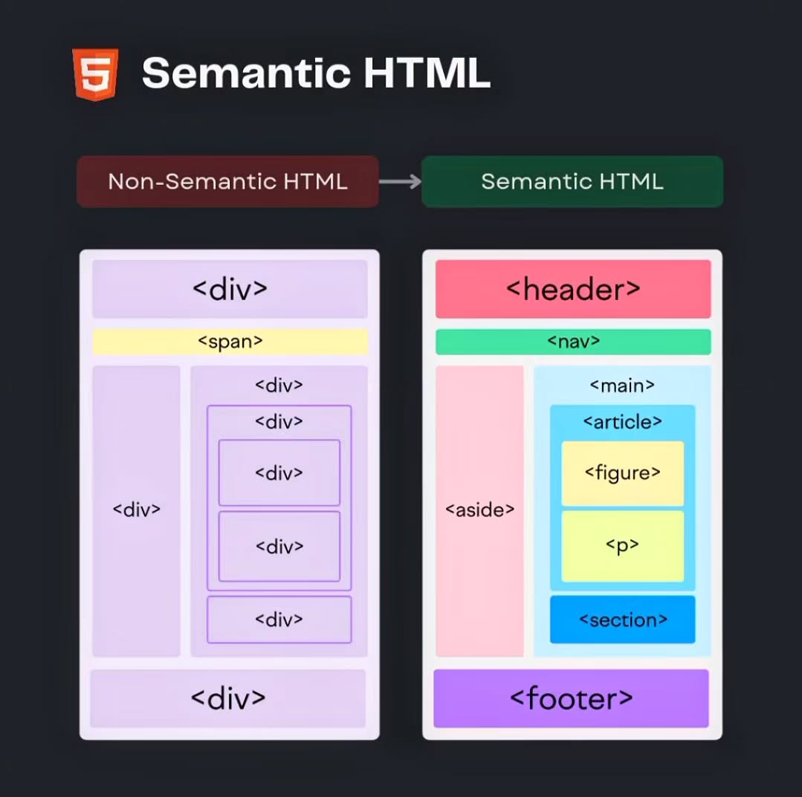
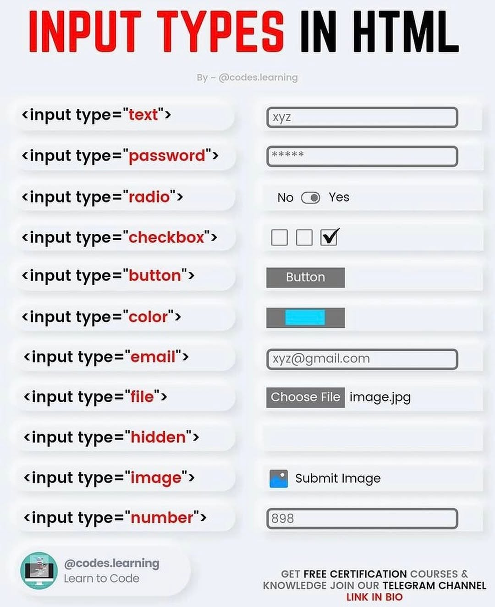
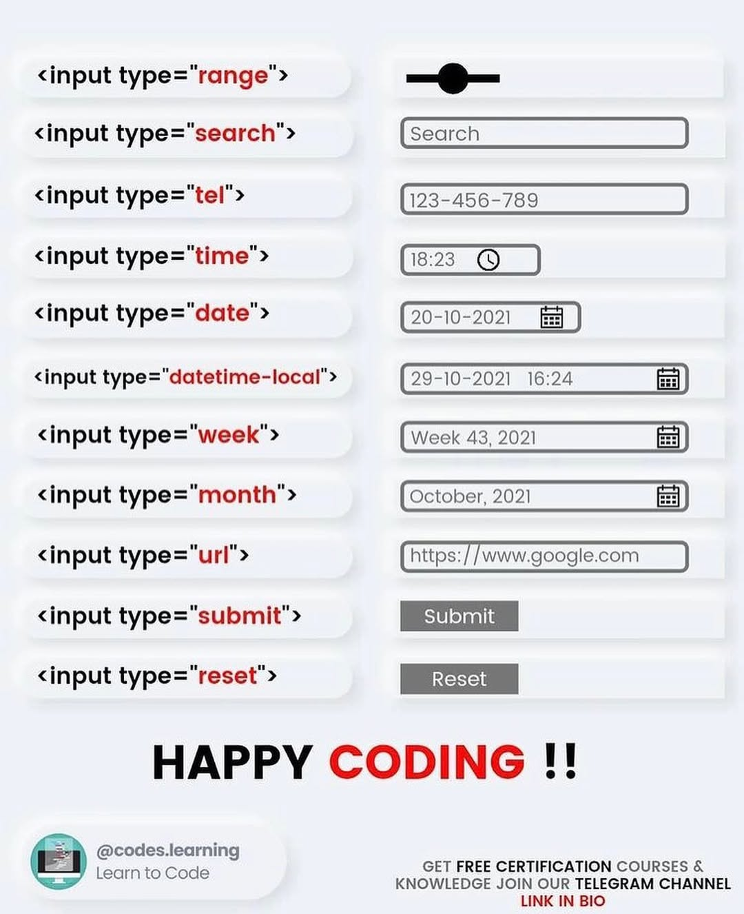

## Semántica de HTML5

### **Alternativas de 
**
| Etiqueta HTML | Descripción                                                                                              |
|-----------------|----------------------------------------------------------------------------------------------------------|
| `<article>`    | Representa un contenido independiente y autocontenido, como un artículo de blog, un post de foro o una noticia. |
| `<header>`     | Define la cabecera de un documento o sección, generalmente contiene el título, logo o menú de navegación.        |
| `<section>`    | Define una sección temática en un documento, como un capítulo, una introducción o un pie de página.           |
| `<nav>`        | Define una sección de enlaces de navegación.                                                              |
| `
`    | Especifica detalles adicionales que el usuario puede abrir y cerrar.                                        |
| `<main>`       | Especifica el contenido principal de un documento.                                                          |
| `<figure>`     | Representa contenido independiente, como imágenes, ilustraciones, diagramas, etc.                               |
| `<dialog>`     | Define un cuadro de diálogo o subventana.                                                                 |
| `<footer>`     | Define el pie de página de un documento o sección.                                                         |

## HTML Basics Cheatsheet
Aquí tienes la tabla con la información en español:  

| **Categoría**             | **Etiqueta HTML**      | **Descripción en Español**        |
|---------------------------|------------------------|------------------------------------|
| **Estructura Básica**      | `<!DOCTYPE>`          | Versión de HTML                   |
|                           | `<html>`              | Documento HTML                     |
|                           | `<head>`              | Información de la página           |
|                           | `<body>`              | Contenido de la página             |
| **Información de la Página** | `<meta />`        | Metadatos                          |
|                           | `<title>`             | Título                             |
|                           | `<link />`            | Enlace a un recurso                |
|                           | `<script>`            | Recurso de script                  |
| **Listas**                | `<ol>`                | Lista ordenada                     |
|                           | `<ul>`                | Lista desordenada                  |
|                           | `<li>`                | Elemento de lista                  |
| **Enlaces**               | `<a href="">`         | Enlace a una página                |
|                           | `<a href="mailto:">`  | Enlace de correo electrónico       |
|                           | `<a name="name">`     | Enlace de anclaje                  |
|                           | `<a href="#name">`    | Enlace a un anclaje                |
| **Formularios**           | `<form>`              | Formulario                         |
|                           | `<label>`             | Etiqueta de entrada                |
|                           | `<input />`           | Entrada de formulario              |
|                           | `<select>`            | Cuadro desplegable                 |
|                           | `<optgroup>`          | Grupo de opciones                  |
|                           | `<option>`            | Opciones del cuadro desplegable    |
|                           | `<textarea>`          | Entrada de texto grande            |
|                           | `<button>`            | Botón                              |
| **Etiquetas Semánticas HTML5** | `<article>`     | Artículo                           |
|                           | `
`           | Detalles de un elemento            |
|                           | `<footer>`            | Pie de página o sección            |
|                           | `<header>`            | Encabezado de página o sección     |
|                           | `<mark>`              | Texto resaltado                    |
|                           | `<section>`           | Sección de una página o artículo   |
|                           | `<figure>`            | Grupo de contenido multimedia y su leyenda |
|                           | `<aside>`             | Contenido fuera del flujo principal |
|                           | `<nav>`               | Enlaces de navegación              |
| **Tablas**                | `<table>`             | Tabla                              |
|                           | `<caption>`           | Título de la tabla                 |
|                           | `<thead>`             | Encabezado de la tabla             |
|                           | `<tbody>`             | Cuerpo de la tabla                 |
|                           | `<tfoot>`             | Pie de la tabla                    |
|                           | `<colgroup>`          | Grupo de columnas                  |
|                           | `<col>`               | Columna                            |
|                           | `<tr>`                | Fila de la tabla                   |
|                           | `<th>`                | Celda de encabezado                |
|                           | `<td>`                | Celda de la tabla                  |
| **Estructura del Documento** | `<h1> a <h6>`      | Encabezados                        |
|                           | `
`               | Sección de la página               |
|                           | ``              | Sección en línea                   |
|                           | `
`                 | Párrafo                            |
|                           | ` `                | Salto de línea                     |
|                           | `
`                | Regla horizontal                   |
| **Etiquetas de Texto**    | `<pre>`               | Texto preformateado                |
|                           | `<b>`                 | Texto en negrita                   |
|                           | `<i>`                 | Texto en cursiva                   |
|                           | `<tt>`                | Crea texto en teletipo             |
|                           | `<cite>`              | Crea una cita                      |
|                           | `<em>`                | Enfatiza una palabra               |
|                           | `<strong>`            | Énfasis fuerte                      |
|                           | `<blockquote>`        | Cita larga                         |
|                           | `<q>`                 | Cita corta                         |
|                           | `<abbr>`              | Abreviatura                        |
|                           | `<del>`               | Texto eliminado                    |
|                           | `<ins>`               | Texto insertado                    |
|                           | ``               | Subíndice                          |
|                           | ``               | Superíndice                        |
|                           | `<bdo>`               | Dirección del texto                |

## Tipos de Input en HTML

