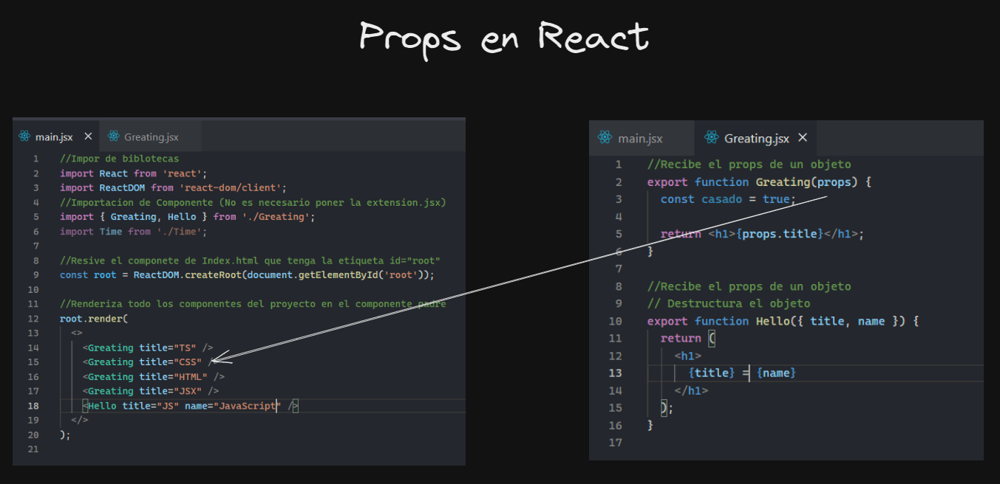
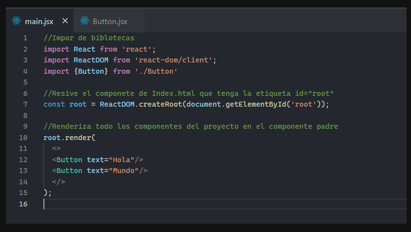
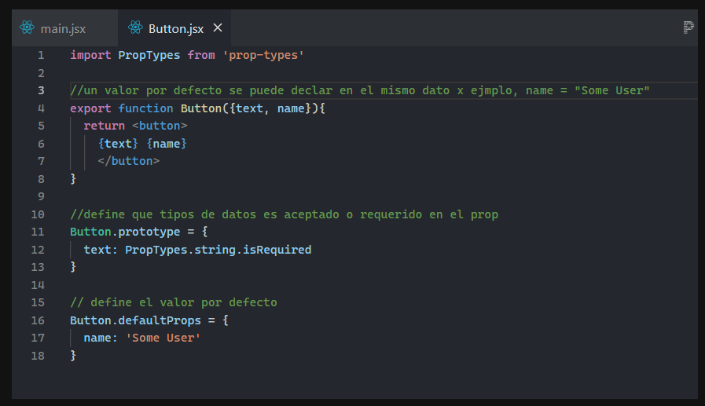
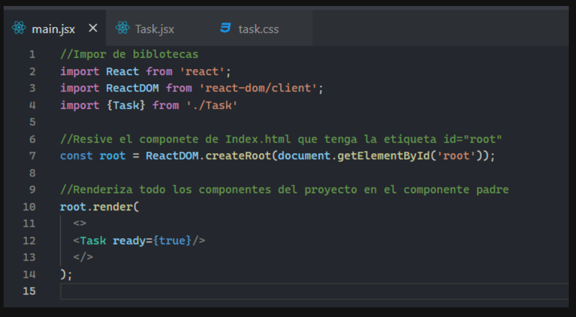
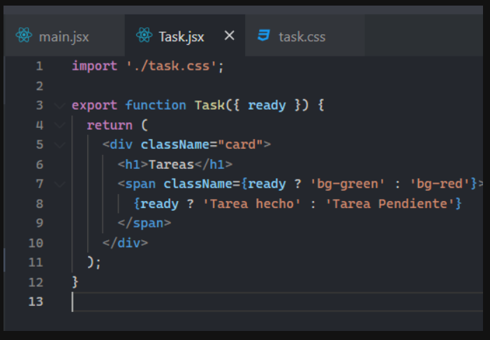
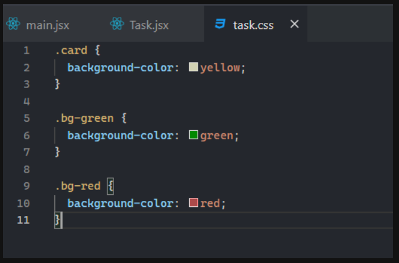

# React.js

> Es una biblioteca para construir interfaces
>
> - Código de interactivo ❌
> - Código de declarativa ✅

Ecmascript 6:
- No es necesario poner la extension del archivo jsx/js en import
- export default = exporta todo el archivo
- se declara como ``import component from './component'`` ya no es necesario poner {}

## Tipografías permitidos

- PascalCase ✅ (Utilizado en js/jsx)
- camelCase ❌
- snake_case ❌
- kebab-case ✅ (utilizado en HTML)

Siempre los nombres de los componentes debe ser en PascalCase. <br>
Usar para dar un nombre de clases a los elementos HTML en React se usa `className="boxCard"`

- HTML = data_id
- jsx = dataId

## React.Fragment

```jsx
{
  // declaraciones ❌
  // expresiones ✅
}
```

### Declarar o mostrar los componentes

- No se mostrara componentes de esta Etiquetas
- Permite tener varios componentes dentro de Fragments

```jsx
// Opción 1
<React.Fragments>
</React.Fragments>

//Opción 2
<>
</>
```

- **Componente:** una función puede devolver un componente (Función que devuelve un elemento).
- **Elemento:** React renderiza elementos
- **children:** renderiza a los hijos del componentes (es un parámetro reservado)

## Hooks

permite usar el estado y otras características de React sin escribir una clase. Antes de los hooks, las características como el estado o el ciclo de vida solo estaban disponibles en componentes de clase, lo que a veces complicaba el código y dificultaba el reuso de la lógica.

Cuando se renteriza el componente puede rendenriza el componente hijo, apesar de no tener cambios

El estado se inicializa una vez

### useState
Este hook te permite agregar estado local a un componente funcional. Te permite declarar una variable de estado y proporciona una función para actualizar ese estado. Cuando el estado cambia, React vuelve a renderizar el componente.

```jsx
import React, { useState } from 'react';

const Example = () => {
  const [count, setCount] = useState(0);

  return (
    <div>
      <p>You clicked {count} times</p>
      <button onClick={() => setCount(count + 1)}>Click me</button>
    </div>
  );
};

```

### useEffect
 Este hook te permite realizar efectos secundarios en componentes funcionales. Puedes pensar en ``useEffect`` como una combinación de ``componentDidMount``, ``componentDidUpdate`` y ``componentWillUnmount`` en componentes de clase. Puedes usar ``useEffect`` para ejecutar código después de que un componente se monte, actualice o desmonte

 ```jsx
 import React, { useState, useEffect } from 'react';

const Example = () => {
  const [count, setCount] = useState(0);

  useEffect(() => {
    // Este efecto se ejecutará después de que el componente se monte
    document.title = `You clicked ${count} times`;
  }, [count]); // El efecto se ejecutará solo si 'count' cambia

  return (
    <div>
      <p>You clicked {count} times</p>
      <button onClick={() => setCount(count + 1)}>Click me</button>
    </div>
  );
};

```

### useContext
 Este hook te permite acceder al contexto de React en componentes funcionales. El contexto es útil cuando deseas pasar datos a través del árbol de componentes sin tener que pasar props manualmente en cada nivel.

 ```jsx
 import React, { useContext } from 'react';

// Creamos un contexto
const MyContext = React.createContext();

// Componente que proporciona el contexto
const MyProvider = ({ children }) => {
  const value = 'Hello from Context';
  return <MyContext.Provider value={value}>{children}</MyContext.Provider>;
};

// Componente que consume el contexto
const MyComponent = () => {
  const contextValue = useContext(MyContext);
  return <p>{contextValue}</p>;
};

// Uso del proveedor y del componente que consume el contexto
const App = () => {
  return (
    <MyProvider>
      <MyComponent />
    </MyProvider>
  );
};

```

## Props
son parámetros que reciben los componentes en la función declaradas y son enviados a traves de componentes renderizadas.


"Props" es una abreviatura de "propiedades" en React. Son datos que se pueden pasar de un componente padre a un componente hijo en React. Las props son de solo lectura, lo que significa que el componente hijo no puede modificar directamente las props que recibe.

Cuando defines un componente en React, puedes incluir propiedades como argumentos en la declaración de la función. Estas propiedades se pueden acceder dentro del componente a través del objeto props.

## Drops types
Define que tipos de datos puede recibir por parámetros

Opción 1:
```bash
npm install --save prop-types
```

Opción 2:
```bash
npm i prop-types
```




## Estilos Interactivos o Dinámicos en React





## Event Handler
es una función que se ejecuta en respuesta a un evento específico que ocurre en un elemento del DOM. Estos eventos pueden ser como hacer clic en un botón, enviar un formulario, pasar el ratón sobre un elemento, entre otros.

En React, puedes definir manejadores de eventos de manera similar a como lo harías en HTML, pero utilizando la sintaxis de JSX y pasando la función que quieres que se ejecute como prop.

### onClick
Este evento se activa cuando un elemento, como un botón o un enlace, se hace clic.
```jsx
import React from 'react';

const Button = () => {
  const handleClick = () => {
    alert('Button clicked!');
  };

  return (
    <button onClick={handleClick}>
      Click me
    </button>
  );
};

export default Button;

```

### onChange
Este evento se activa cuando el valor de un elemento de entrada, como un campo de texto o un select, cambia
```jsx
import React, { useState } from 'react';

const Input = () => {
  const [value, setValue] = useState('');

  const handleChange = (event) => {
    setValue(event.target.value);
  };

  return (
    <input type="text" value={value} onChange={handleChange} />
  );
};

export default Input;

```

### onSubmit
Este evento se activa cuando se envía un formulario.
```jsx
import React, { useState } from 'react';

const Form = () => {
  const [username, setUsername] = useState('');
  const [password, setPassword] = useState('');

  const handleSubmit = (event) => {
    event.preventDefault();
    console.log('Username:', username);
    console.log('Password:', password);
    // Aquí puedes enviar los datos del formulario a un servidor, por ejemplo
  };

  return (
    <form onSubmit={handleSubmit}>
      <input
        type="text"
        value={username}
        onChange={(e) => setUsername(e.target.value)}
        placeholder="Username"
      />
      <input
        type="password"
        value={password}
        onChange={(e) => setPassword(e.target.value)}
        placeholder="Password"
      />
      <button type="submit">Submit</button>
    </form>
  );
};

export default Form;

```
> PreventDefault (quita los comportamientos por defecto)

## API(tipos)
### Canvas API
La Canvas API proporciona una manera de dibujar gráficos, animaciones y otros gráficos interactivos en una página web utilizando JavaScript. Con esta API, puedes manipular píxeles en un lienzo HTML, lo que te permite crear visualizaciones personalizadas, juegos y aplicaciones de dibujo en la web.Por ejemplo, puedes crear un lienzo y dibujar un rectángulo rojo en él utilizando la Canvas API de esta manera.

```jsx
const canvas = document.getElementById('myCanvas');
const ctx = canvas.getContext('2d');

ctx.fillStyle = 'red';
ctx.fillRect(10, 10, 50, 50);
```
### LocalStorage y SessionStorage API
Estas APIs proporcionan un medio para almacenar datos localmente en el navegador del usuario. ``localStorage`` almacena datos con una duración ilimitada, mientras que ``sessionStorage`` almacena datos solo durante la sesión del navegador. Ambas APIs permiten almacenar datos como pares clave-valor y son útiles para almacenar pequeñas cantidades de datos, como preferencias de usuario o tokens de sesión.Por ejemplo, puedes almacenar y recuperar datos en ``localStorage`` de esta manera.
```jsx
// Almacenar datos
localStorage.setItem('username', 'john_doe');

// Recuperar datos
const username = localStorage.getItem('username');

```

### Fetch API
La Fetch API proporciona una interfaz JavaScript para acceder y manipular recursos en la red, como archivos JSON o XML, a través de peticiones HTTP. Esta API proporciona una forma más moderna y flexible de realizar solicitudes de red en comparación con métodos anteriores como XMLHttpRequest (XHR).Por ejemplo, puedes realizar una solicitud GET a una API RESTful utilizando la Fetch API.
```jsx
fetch('https://api.example.com/data')
  .then(response => response.json())
  .then(data => console.log(data))
  .catch(error => console.error('Error:', error));
```

## Asincronía en React
La sincronía se refiere a la ejecución de operaciones en secuencia, una después de la otra, en el orden en que son escritas en el código. Cada operación espera a que la anterior termine antes de comenzar su ejecución, lo que resulta en un flujo de ejecución predecible y lineal.

asincronía implica que las operaciones no necesariamente se ejecutan en secuencia. Algunas operaciones pueden comenzar sin esperar a que otras terminen, lo que permite que el programa principal continúe su ejecución mientras las operaciones asincrónicas se realizan en segundo plano.
### Promesas
Las promesas son objetos que representan el resultado eventual de una operación asíncrona. Pueden estar en uno de tres estados: pendiente, cumplida o rechazada. En React, puedes usar promesas para manejar llamadas a API u otras operaciones asíncronas.
```jsx
import React, { useState, useEffect } from 'react';

const MyComponent = () => {
  const [data, setData] = useState(null);

  useEffect(() => {
    fetch('https://api.example.com/data')
      .then(response => response.json())
      .then(data => setData(data))
      .catch(error => console.error('Error:', error));
  }, []);

  return (
    <div>
      {data ? <p>{data}</p> : <p>Loading...</p>}
    </div>
  );
};

export default MyComponent;

```

### async/await
Las funciones async en JavaScript permiten escribir código asincrónico de manera síncrona, haciendo que el código sea más legible y fácil de entender. En React, puedes usar async/await junto con las llamadas a API, acciones asíncronas y efectos secundarios.
```jsx
import React, { useState, useEffect } from 'react';

const MyComponent = () => {
  const [data, setData] = useState(null);

  useEffect(() => {
    const fetchData = async () => {
      try {
        const response = await fetch('https://api.example.com/data');
        const data = await response.json();
        setData(data);
      } catch (error) {
        console.error('Error:', error);
      }
    };

    fetchData();
  }, []);

  return (
    <div>
      {data ? <p>{data}</p> : <p>Loading...</p>}
    </div>
  );
};

export default MyComponent;
```

### Callbacks
Los callbacks son funciones que se pasan como argumentos a otras funciones y se ejecutan después de que se complete alguna operación, como una llamada a API. En React, los callbacks pueden ser útiles para manejar eventos o comunicarse entre componentes.
```jsx
import React, { useState } from 'react';

const MyComponent = () => {
  const [data, setData] = useState(null);

  const fetchData = () => {
    fetch('https://api.example.com/data')
      .then(response => response.json())
      .then(data => setData(data))
      .catch(error => console.error('Error:', error));
  };

  return (
    <div>
      <button onClick={fetchData}>Fetch Data</button>
      {data ? <p>{data}</p> : <p>No data yet</p>}
    </div>
  );
};

export default MyComponent;
```

## Router
React Router es una biblioteca que permite agregar enrutamiento a una aplicación React. Proporciona componentes que te permiten definir rutas y renderizar componentes específicos cuando se corresponda la URL con una ruta específica.

Instalación del Router DOM v6
```bash
npm i react-router-dom
```

### BrowserRouter:
 Este componente proporciona la funcionalidad de enrutamiento a tu aplicación. Debes envolver tu aplicación con ``<BrowserRouter>`` para habilitar el enrutamiento en tu aplicación. En versiones anteriores de React Router, se usaba ``BrowserRouter`` o ``HashRouter``, pero en la versión 6, ``BrowserRouter`` es la opción preferida.

 ```jsx
import { BrowserRouter } from 'react-router-dom';

ReactDOM.render(
  <BrowserRouter>
    <App />
  </BrowserRouter>,
  document.getElementById('root')
);
```

### Link
El componente ``Link`` se utiliza para crear enlaces de navegación entre diferentes rutas de tu aplicación. Proporciona una forma declarativa de crear enlaces sin tener que preocuparte por la manipulación manual del estado del navegador.
```jsx
import { Link } from 'react-router-dom';

<Link to="/about">About</Link>

```

### Routes
El componente ``Routes`` se utiliza para definir las rutas y qué componentes deben ser renderizados cuando una ruta coincide con la URL actual. Es similar al antiguo componente ``Switch``, pero con una API más flexible.
```jsx
import { Routes, Route } from 'react-router-dom';

<Routes>
  <Route path="/" element={<Home />} />
  <Route path="/about" element={<About />} />
  <Route path="/contact" element={<Contact />} />
</Routes>
```

### Navigate
El componente ``Navigate`` se utiliza para navegar programáticamente a una ruta específica en respuesta a eventos o lógica en tu aplicación.
```jsx
import { Navigate } from 'react-router-dom';

const SomeComponent = () => {
  // Navegar a una ruta específica
  return <Navigate to="/about" />;
};
```

### Outlet
El componente ``Outlet`` se utiliza como marcador de posición en el que React Router renderizará los componentes correspondientes a la ruta coincidente. Es similar al antiguo Switch en versiones anteriores, pero es más flexible y permite la anidación de rutas.
```jsx
import { Outlet } from 'react-router-dom';

const App = () => {
  return (
    <div>
      <nav>
        <Link to="/">Home</Link>
        <Link to="/about">About</Link>
      </nav>
      <Outlet /> {/* Aquí se renderizarán los componentes de las rutas coincidentes */}
    </div>
  );
};
```

## Redux
