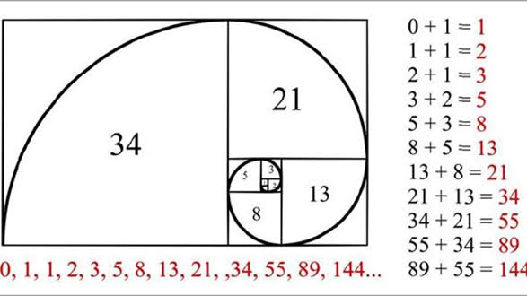

# [Scrum](https://www.atlassian.com/es/agile/scrum) para Desarrolladores
## 1. Introducción

### ¿Qué es Scrum?

Scrum es un marco de trabajo ágil utilizado para gestionar proyectos de desarrollo de software mediante ciclos cortos llamados Sprints.

### Herramientas comunes

* Jira
* Azure DevOps
* Trello
* ClickUp

---

# 2. Estructura de Scrum

```text
Producto
│
├── Product Backlog
│
├── Epic
│   ├── Story
│   │   ├── Task
│   │   │   ├── Subtask
│   │   │   └── Subtask
│   │   └── Task
│   │
│   └── Story
│
└── Sprint
    ├── Story
    ├── Bug
    ├── Spike
    └── Task
```

---

# 3. Artefactos de Trabajo

## Product Backlog

Lista completa de todo el trabajo pendiente del producto.

### Ejemplos

* Historias
* Bugs
* Mejoras
* Spikes
* Tareas técnicas

---

## Sprint

Periodo de tiempo fijo donde se desarrolla un conjunto de funcionalidades.

Duración común:

* 1 semana
* 2 semanas
* 3 semanas
* 4 semanas

---

# 4. Tipos de Elementos

## Epic

Funcionalidad grande que agrupa varias historias.

### Ejemplo

```text
Sistema de Autenticación
```

Incluye:

* Registro
* Login
* Recuperación de contraseña

---

## Story (Historia de Usuario)

Necesidad expresada desde la perspectiva del usuario.

### Formato

```text
Como usuario
quiero iniciar sesión
para acceder a mi cuenta
```

---

## Task

Trabajo técnico necesario para completar una historia.

### Ejemplo

```text
Crear pantalla Login
```

---

## Subtask

División más pequeña de una tarea.

### Ejemplo

```text
Task:
Crear pantalla Login

Subtasks:
- Crear formulario
- Agregar validaciones
- Crear estilos
```

---

## Bug

Error detectado en el sistema.

### Ejemplo

```text
El login falla cuando el correo contiene mayúsculas
```

---

## Spike

Actividad de investigación.

### Ejemplo

```text
Investigar integración con Google OAuth
```

Normalmente no genera funcionalidad final.

---

# 5. Estados de Trabajo

Flujo típico:

```text
Backlog
↓
To Do
↓
In Progress
↓
Code Review
↓
Testing
↓
Done
```

## Backlog

Pendiente de planificación.

## To Do

Listo para comenzar.

## In Progress

En desarrollo.

## Code Review

Esperando revisión técnica.

## Testing

En pruebas.

## Done

Completado.

---

# 6. Eventos Scrum

## Refinement

Reunión para aclarar historias futuras.

Objetivo:

* Resolver dudas
* Agregar criterios de aceptación
* Estimar esfuerzo

---

## Sprint Planning

Reunión para definir qué entrará al Sprint.

Resultado:

```text
Sprint Backlog
```

---

## Daily Scrum

Reunión diaria de 15 minutos.

Normalmente respondes:

### ¿Qué hice ayer?
```bash
Terminé el formulario de login.
```

### ¿Qué haré hoy?
```bash
Integraré el endpoint de autenticación.
```

### ¿Tengo bloqueos?
```bash
Sí, el endpoint aún no está disponible.
```

---

## Sprint Review

Demostración de lo desarrollado.

---

## Sprint Retrospective

Reunión de mejora continua.

Preguntas:

* ¿Qué salió bien?
* ¿Qué salió mal?
* ¿Qué podemos mejorar?

---

# 7. Bloqueos y Dependencias

## Blocked

Estado donde una tarea no puede continuar.

### Ejemplos

* API no disponible
* Accesos pendientes
* Requerimiento incompleto

## ¿Qué es una tarea bloqueada?

> Es una tarea que no puede continuar por alguna dependencia.

## Ejemplos reales:

### Caso 1

Debes consumir una API.

Pero Backend aún no la terminó.

**Bloqueada por:**
```bash
Dependencia de Backend
```

### Caso 2

Necesitas accesos.

Pero Infraestructura no los ha entregado.

**Bloqueada por:**
```bash
Permisos pendientes
```

### Caso 3

Esperas definición del negocio.

**Bloqueada por:**
```bash
Requerimiento ambiguo
```

## ¿Cómo se bloquea una tarea?

Depende de la herramienta.

**En Jira normalmente:**

1. Abrir ticket.
2. Cambiar estado a "Blocked" o agregar etiqueta.
3. Escribir comentario.

### Ejemplo:
```bash
Bloqueado.

Motivo:
El endpoint GET /pets/filter aún no está disponible.
Esperando entrega de Backend.
```

---

## Dependency

Cuando una tarea depende de otra.

Ejemplo:

```text
Frontend Login
↓
Depende de
↓
Backend Login API
```

---

# 8. Estimación

## Story Points

Medida relativa de complejidad.

No representan horas.

### Escala Fibonacci

```text
1
2
3
5
8
13
21
```



### Referencia

```text
1  = Muy simple
2  = Simple
3  = Normal
5  = Compleja
8  = Muy compleja
13 = Demasiado grande
```

---

## Velocity

Cantidad de Story Points completados por Sprint.

### Ejemplo

```text
Sprint 1 = 32 puntos
Sprint 2 = 35 puntos
Sprint 3 = 38 puntos

Velocity promedio = 35
```

---

# 9. Flujo Git en Scrum

## Pull Request (PR)

Solicitud para integrar cambios al repositorio principal.

---

## Code Review

Revisión del código por otro desarrollador.

Objetivos:

* Detectar errores
* Validar calidad
* Compartir conocimiento

---

## Merge

Integración definitiva de una rama en otra.

Ejemplo:

```text
feature/US-102-login
            ↓
          develop
```

---

# 10. Definition of Done (DoD)

Define cuándo una tarea está realmente terminada.

## Ejemplo de DoD

* Código desarrollado
* Compila correctamente
* Pruebas ejecutadas
* Code Review aprobado
* Sin conflictos
* Desplegado en ambiente de pruebas
* Aceptado por Product Owner

---

# 11. Flujo Completo de Trabajo del Desarrollador

```text
Epic
↓
Story
↓
Task
↓
Subtask
↓
Desarrollo
↓
Commit
↓
Push
↓
Pull Request
↓
Code Review
↓
Testing
↓
Merge
↓
Done
```

---

# 12. Glosario Rápido

| Término      | Resumen                  |
| ------------ | ------------------------ |
| Epic         | Funcionalidad grande     |
| Story        | Necesidad del usuario    |
| Task         | Trabajo técnico          |
| Subtask      | División de una tarea    |
| Bug          | Error                    |
| Spike        | Investigación            |
| Sprint       | Ciclo de trabajo         |
| Backlog      | Trabajo pendiente        |
| Refinement   | Refinar historias        |
| Planning     | Planificar sprint        |
| Daily        | Reunión diaria           |
| Blocked      | Trabajo detenido         |
| Dependency   | Dependencia entre tareas |
| PR           | Solicitud de revisión    |
| Code Review  | Revisión de código       |
| Merge        | Integración de cambios   |
| Story Points | Complejidad              |
| Velocity     | Capacidad del equipo     |
| DoD          | Criterios de terminado   |
