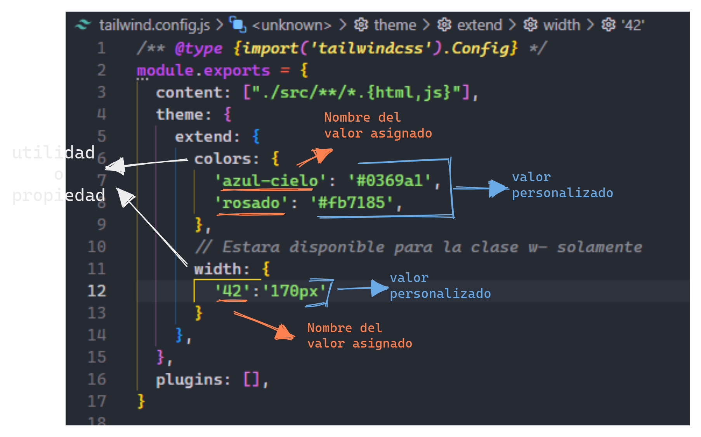
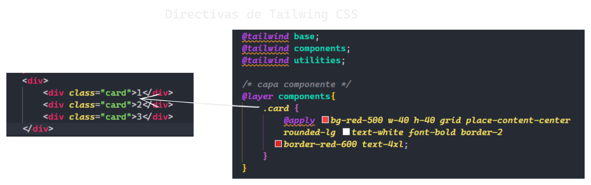
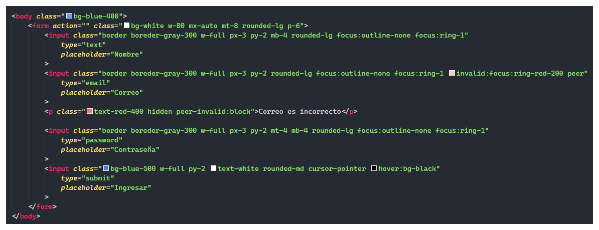
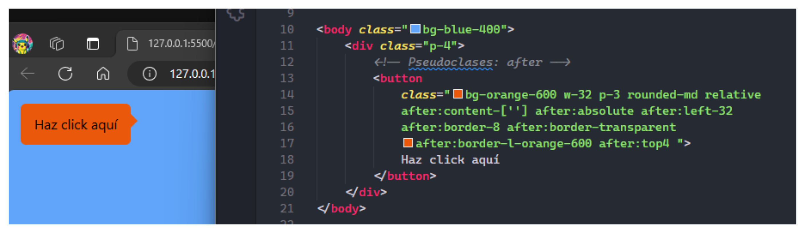
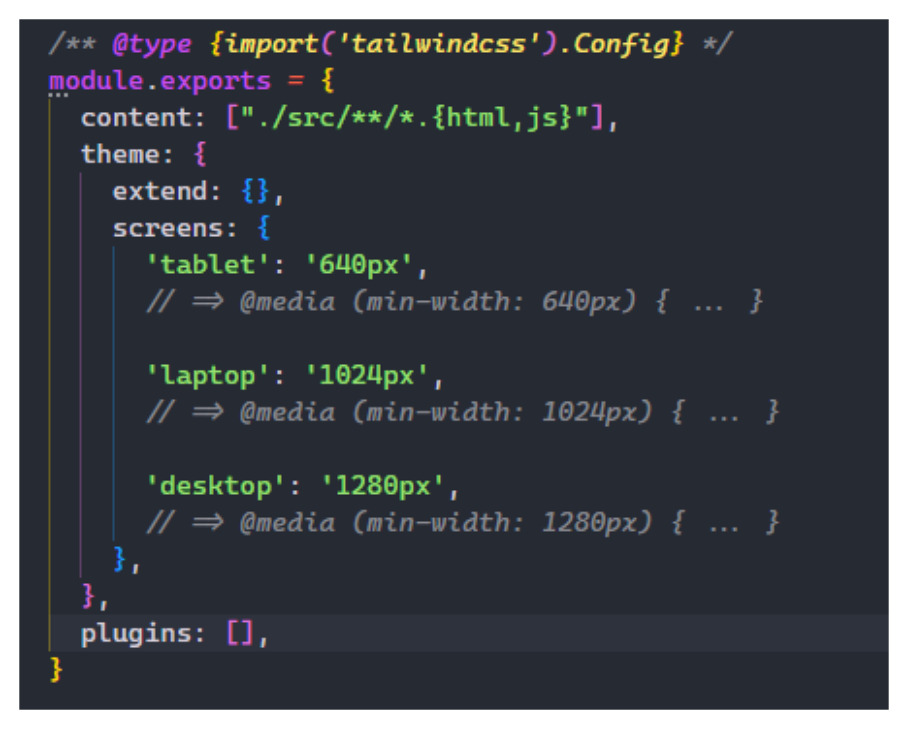
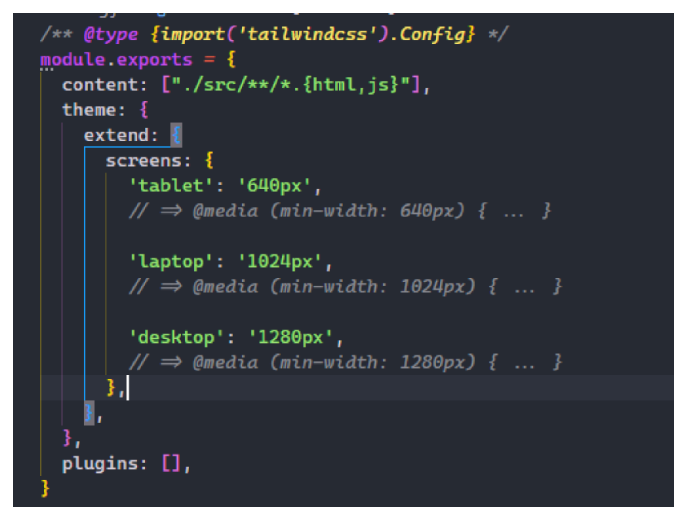
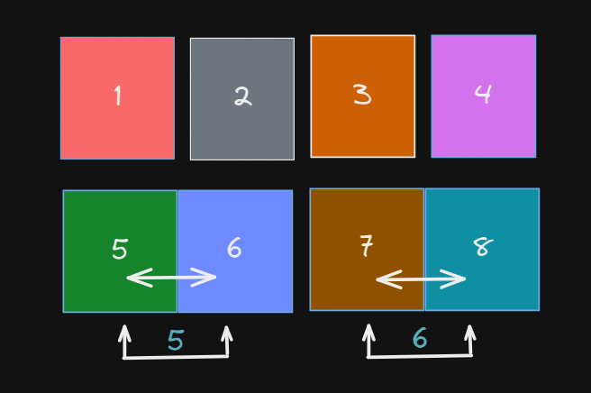
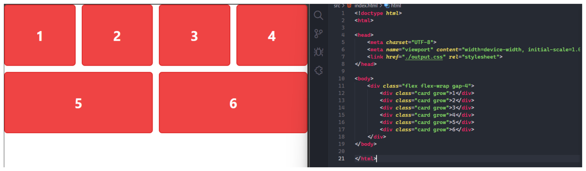
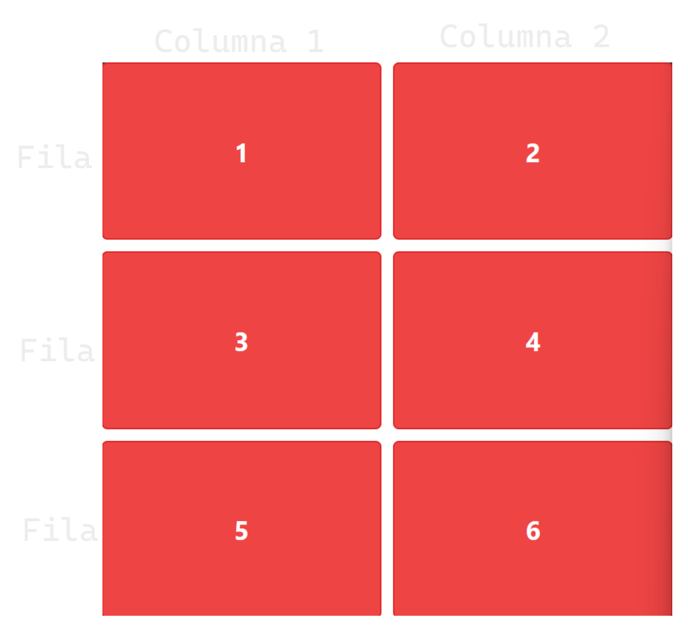
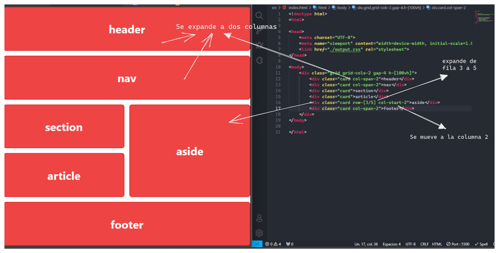

# Documentación de Tailwind CSS

## Instalación y Configuración en CLI v3.4.1
**1. Instalar tailwind en el proyecto**
```bash
npm install -D tailwindcss
npx tailwindcss init
```

**2. Configurar ```tailwind.config.js```**
```js
/** @type {import('tailwindcss').Config} */
module.exports = {
  content: ["./src/**/*.{html,js}"],
  theme: {
    extend: {},
  },
  plugins: [],
}
```
copiar y pegar esta linea en ```tailwind.config.js```
```js
content: ["./src/**/*.{html,js}"],
```

**3. Agregar las directivas de tailwind en el archivo css (style.css o input.css) como lo hayas renombrado**
```css
@tailwind base;
@tailwind components;
@tailwind utilities;
```

**4. Iniciar el proceso de compilación**
> Si ya tienes instalado tailwind en tu proyecto solo, ejecutar este comando en vez de toda las anteriores.
```bash
npx tailwindcss -i ./src/input.css -o ./src/output.css --watch
```

**5. Ejemplo de uso de tailwind en HTML**
```html
<!doctype html>
<html>
<head>
  <meta charset="UTF-8">
  <meta name="viewport" content="width=device-width, initial-scale=1.0">
  <link href="./output.css" rel="stylesheet">
</head>
<body>
  <h1 class="text-3xl font-bold underline">
    Hello world!
  </h1>
</body>
</html>
```

## Ventajas de usar Tailwind CSS
- **Alta personalización:** Tailwind CSS es un framework altamente personalizable. Aunque viene con una configuración predeterminada, es simple sobre-escribirla gracias al fichero de configuración tailwind.config.js. Este archivo de configuración permite una fácil personalización de paletas de colores, estilizado, espaciado, temas, etc.

- **Diseño personalizado:** Puedes crear diseños únicos sin depender de un archivo css separado. Con Tailwind, el css se construye en función de las necesidades de tu proyecto.

- **Clases de utilidad:** En lugar de memorizar nombres de clases predefinidas, puedes crear interfaces de usuario utilizando clases pequeñas y reutilizables.

- **Adaptable:** TailwindCSS permite cambiar los nombres de las clases que sirven para hacer diseños adaptables (responsive) y agregar los breakpoints que sean necesarios para adaptarlos a cada proyecto.

- **No necesitas archivos CSS porque todo se trabaja en el HTML:** Ya que sólo necesitas enlazar el framework y utilizar las clases de utilidad que te proporciona.¨

## Clases de utilidades
>En Tailwind CSS, las **"utilidades"** se refieren a las clases CSS que proporciona el framework para estilizar elementos HTML de manera rápida y eficiente, sin necesidad de escribir CSS personalizado. Estas clases están diseñadas para ser altamente comunes y útiles, abarcando una amplia gama de estilos y comportamientos comunes.
```html
<!-- Estructura de tailwind en html -->
<div class="utilidades-valor"></div>
```
- **Utilidades** mas comunes:
    - m  = Margen
    - p  = padding
    - bg = background
    - w  = ancho
    - h  = alto

```html
<div class="bg-[valorEspecifico]"></div>
<div class="bg-predeterminado"></div>
<!-- ejemplo: -->
<div class="bg-[#ffff]"></div>
<div class="bg-orange-200"></div>
```

## Personalizar utilidades en Tailwind como global
Utilidades personalizadas en ```tailwind.config.js```
```js
    theme:{
        extend:{   
            propiedad: {
                'name': 'valor'
            }
        }
        }
```


```html
<!-- azul-cielo = #0369a1 -->
<h1 class="text-azul-cielo"></h1>
      <!-- text-[#0369a1] -->

<!-- 42 = 170px -->
<p class="w-42"></p>
     <!-- w-[170px] -->
```

## Directivas de Tailwind css
Son instrucciones que nos permiten insertar código a nuestro archivo final CSS. Se diferencian por un @ al inicio y son fundamentales para la organización y funcionamiento de Tailwind CSS. Las principales directivas son:
1. @tailwind base: Esta directiva inicializa todos los elementos de nuestro HTML sin estilo. Maneja los elementos HTML como div, span, ul, p, h1, etc.

2. @tailwind components: Esta directiva maneja las clases. Se utiliza para inyectar los componentes CSS de Tailwind en tu CSS.

3. @tailwind utilities: Esta directiva maneja las utilidades, que son todas aquellas propiedades referentes a los atributos CSS (por ejemplo, filter: grayscale(100%)).

### Directivas @layer, @apply
 La directiva @layers se usa para especificar en qué capa de Tailwind CSS deben ser incluidas las clases de utilidades aplicadas con @apply. Esta es una característica avanzada que permite controlar la prioridad de las clases de utilidades y cómo se aplican en relación con otras reglas CSS.

>**Por ejemplo,** *Supongamos que tenemos un botón personalizado que queremos crear con Tailwind CSS. Vamos a definir un conjunto de clases para este botón y luego usar la directiva @apply para aplicarlas dentro de una regla CSS personalizada. Además, usaremos @layers para especificar que estas clases deben aplicarse en la capa de componentes (components) en lugar de la capa de utilidades (utilities)* Aquí está el código:
```html
<button class="custom-btn">Haz clic aquí</button>
```

```css
/* CSS personalizado */
@tailwind base;
@tailwind components;
@tailwind utilities;

@layer components {
  .custom-btn {
    @apply px-4 py-2 bg-blue-500 text-white rounded-md hover:bg-blue-600;
  }
}

```

**Otro ejemplo:**

>"Las directivas @layer y @apply nos permite aplicar estilos solo al componente de esa clase especificado."

## Algunos clases o utilidades especiales de tailwindcss
- **Mas usadas:**
    - h-full = 100% de su contenedor.
    - h-100vh = ocupa todo el tamaño de la página
    - space-y-1 = agrega espacio dentro del contenedor donde esta aplicando la clase. (espacio-abajo-arriba-0.25rem).
    - dark: = aplica las propiedades a en modo oscuro, `class="dark:text-white"`.
    - grow = Hace que un elemento crezca para ocupar el espacio disponible dentro de su contenedor.
    - shrink = Hace que un elemento reduzca su tamaño para ajustarse al contenido o al espacio disponible dentro de su contenedor.
    - basic = Establece estilos básicos para un elemento, como la alineación al centro y un borde delgado.

- **gradient class:**
    - bg-clip-text = quita el fondo del texto
    - text-transparent = pone el texto transparente
    - bg-gradient-to-r = Indica que el gradiente va de izquierda a derecha
    - bg-gradient-to-l = Indica que el gradiente va de derecha a izquierda
    - bg-gradient-to-t = de arriba hacia abajo
    - bg-gradient-to-b = de abajo hacia arriba
    - from-pink-500 = from (Establece el color inicial del gradiente en un tono específico)
    - to-violet-500 = to (establece el color final del gradiente en un tono específico)


- **Estados class:**
    - hover: 
        - Aplica estilos cuando el cursor del mouse se encuentra sobre el elemento.
    - focus: 
        - Aplica estilos cuando el elemento está enfocado, por ejemplo, después de hacer clic en él o al navegar por él usando la tecla TAB.
    - active: 
        - Aplica estilos cuando el elemento está siendo activado, generalmente al hacer clic en él.
    - disabled: 
        - Aplica estilos cuando el elemento está desactivado o no se puede interactuar con él.
    - first-child: 
        - Aplica estilos al primer hijo de un contenedor.
    - last-child: 
        - Aplica estilos al último hijo de un contenedor.
    - odd: 
        - Aplica estilos a los hijos impares de un contenedor.
    - even: 
        - Aplica estilos a los hijos pares de un contenedor.



- **Ps:eudoclases:**
    - file:
        - Selecciona elementos `<input>` de tipo "file".
        - Permite aplicar estilos específicos a los botones de carga de archivos en los formularios HTML.

    - marker:
        - Selecciona el marcador de lista de elementos `<li>`.
        - Útil para aplicar estilos al marcador de lista, como cambiar el color o la forma.

    - placeholder:
        - Selecciona el texto de marcador de posición dentro de un elemento de entrada (`<input>`, `<textarea>`).
        - Permite aplicar estilos al texto de marcador de posición, como el color o el tamaño de la fuente.

    - selection:
        - Selecciona el texto seleccionado por el usuario.
        - Útil para aplicar estilos a la selección de texto, como el color de fondo o el color del texto.

    - first-line:
        - Selecciona la primera línea de un bloque de texto.
        - Permite aplicar estilos específicos a la primera línea de un párrafo o cualquier otro bloque de texto.

    - first-letter:
        - Selecciona la primera letra de un bloque de texto.
        - Útil para aplicar estilos específicos a la primera letra de un párrafo o cualquier otro bloque de texto, como hacerla más grande o aplicar un estilo decorativo.

    - *:
        - Este selector se utiliza para aplicar estilos a todos los elementos.
        - Por ejemplo, `*:hover` aplicaría estilos cuando se hace hover sobre cualquier elemento en la página.

    - after: 
        - agrega contenido, en el contenedor a traves de los valores que se le indique.



- **Valores de posicionamiento :**

    - **`relative`**
        - Establece la posición de un elemento de acuerdo con su posición original en el flujo del documento.
        - Útil como contenedor para elementos posicionados absolutamente dentro de él.

    - **`absolute`**
        - Elimina un elemento del flujo del documento y lo coloca en relación con su primer ancestro posicionado.
        - Útil para posicionar elementos de forma absoluta en relación con su contenedor más cercano.

    - **`fixed`**
        - Elimina un elemento del flujo del documento y lo coloca en relación con la ventana del navegador.
        - Útil para crear elementos que se mantienen fijos en la pantalla, como barras de navegación.

    - **`static`**
        - Restaura la posición predeterminada de un elemento.
        - Es la posición predeterminada de los elementos y no se aplica ningún posicionamiento especial.

    - **`sticky`**
        - Se comporta como `relative` hasta que un elemento alcanza una posición específica en la ventana del navegador, momento en el que se comporta como `fixed`.
        - Útil para crear elementos que se mantienen fijos en una posición específica al hacer scroll.

    - **`inset-{valor}`**
        - Controla el posicionamiento de los elementos en todas las direcciones (arriba, derecha, abajo, izquierda) de manera simultánea.
        - Útil para definir márgenes internos o externos de un elemento de forma rápida.

    - **`top-{valor}`**, **`right-{valor}`**, **`bottom-{valor}`**, **`left-{valor}`**
        - Controlan la posición de un elemento en una dirección específica (arriba, derecha, abajo, izquierda) en relación con su contenedor o ancestro posicionado más cercano.
        - Útiles para ajustar finamente la posición de un elemento.

## BreakPoint (Diseño Responsivo)
>Cinco BreakPoint por defecto, inspirados en las resoluciones habituales de los dispositivos. La resolución inicial sin aplicar los BreakPoint es `sm` equivale a la resolución de dispositivos móviles.

|Breakpoint prefijo |Anchura mínima | CSS                                      |
|-------------------|---------------|------------------------------------------|
| sm                | 640px         | `@media (min-width: 640px) { ... }`      |
| md                | 768px         | `@media (min-width: 768px) { ... }`      |
| lg                | 1024px        | `@media (min-width: 1024px) { ... }`     |
| xl                | 1280px        | `@media (min-width: 1280px) { ... }`     |
| 2xl               | 1536px        | `@media (min-width: 1536px) { ... }`     |

*Esto significa que los estilos definidos dentro de @media (min-width: 640px) { ... } se aplicarán a pantallas con un ancho de al menos 640px. En otras palabras, estos estilos se activarán después de que la pantalla tenga un ancho de al menos 640px, y se aplicarán a pantallas de ese tamaño y mayores.*

### Personalizar los BreakPoint
- Poner las las resoluciones personalizadas en `theme>screens`, deshabilitad los breakpoints predeterminadas.



- Si se quiere usar las resolucines predeterminadas y las personalizadas poner en `theme>extend>screens`


## Uso de Flex y grid
- `flex` > `grow` = Hace que un elemento crezca para ocupar el espacio disponible dentro de su contenedor.



- grid = Grid es responsivo, los contenedor van desplazándose de acuerdo a lo que ocupe el tamaño los demás contenedores.


