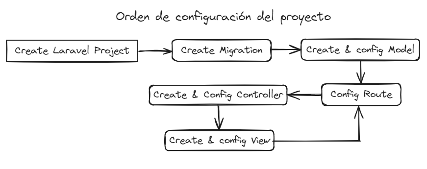
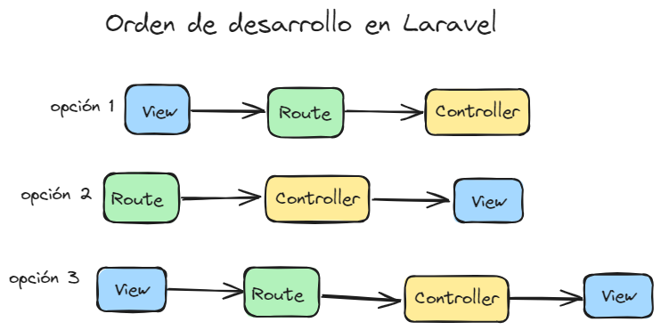
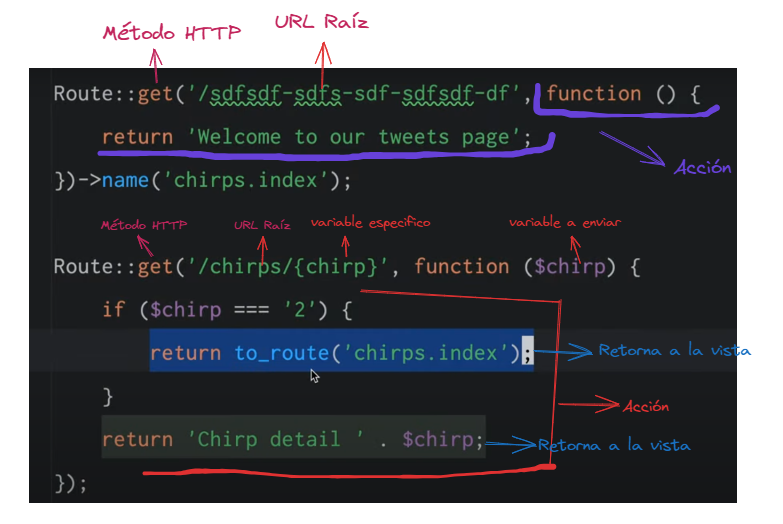
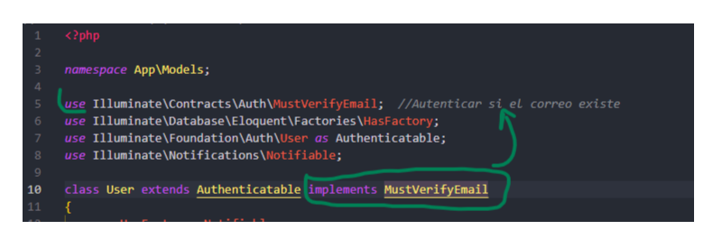
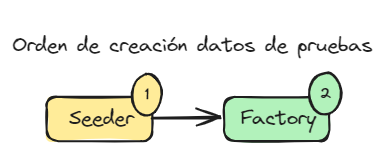

<p align="center"><a href="https://laravel.com" target="_blank"></a></p>

>**Descripción:** <br>
> Que proyectos se puede realizar en laravel:
>- CMS con Laravel Voyager
>- Web Responsive con Livewire y WireUI
>- Autenticaciones de resgistro con Brezze
>- entre otros mas.

## <a name="id0">Indice</a>
- [Instalación](#id1)
- [Reglas de Laravel](#id2)
- [Configuración .env](#id3)
- [Comando de php artisan](#id4)
- [Esquema de creación del proyecto](#id5)
- [Esquema de desarrollo del Proyecto](#id6)
- [Migración](#id7)
- [Modelos](#id8)
- [Rutas](#id9)
- [Controladores](#id10)
- [Vistas](#id11)
- [Paquetes de Idiomas](#id12)
- [Métodos HTTP](#id13)
- [Clases Métodos](#id14)
- [Autenticaciones](#id15)
- [Seeders & Factories](#id16)

## [Instalación](#id0) <a name="id1"></a>
### Comandos de instalación de Laravel
```bash
# Crea el proyecto en la ultima version de laravel
composer create-project laravel/laravel: example-app ``

# Crea el proyecto con una version especifica
composer create-project laravel/laravel: example-app "10.*"
```

## [Reglas de Laravel](#id0) <a name="id2"></a>
>**Snake_case:** se refiere al estilo de escritura en el que cada espacio se reemplaza con un carácter de subrayado y la primera letra de cada palabra se escribe en minúsculas. <br><br>
>**PascalCase:** combina las palabras directamente, sin usar ningún símbolo, estableciendo que la primera letra de cada palabra esté en mayúscula sin excepciones, estando el resto de letras en minúsculas. <br><br>


- Nombre de las tablas en plural: users, datos, etcs..
- Nombre de los modelos en singular y primera letra en Mayúscula: User, Dato, Etc..
- Nunca editar o borrar el archivo ``vendor`` y sus carpetas.
- El nombre de las funciones en los Modelos debe ser en plural o singular según la relación. Ejemplo: ``public function ideas(){}``, ``public function user()``, un usuario puede tener varios ideas.
- las variables se declaran en blade ``{{ $variable->function() }}``
- ``dump('acción');`` visualiza en el navegar el proceso.

## [Configuración .env](#id0) <a name="id3"></a>
>Configuración el entorno de desarrollo del proyecto:
- Nombre del proyecto
- Configuración de la base de dato
- Idiomas (install package lang)
- ``.env`` es ignorado por git
- ``.env.example`` no es ignorado por git

## [Comando de php artisan](#id0) <a name="id4"></a>
```bash
# Ver todo los comandos disponibles
php artisan

# Levantar servidor local
php artisan serve

# Crear migraciones de las BD en el proyecto
php artisan make:migration create_names_table

# Crea y actualiza las tablas en la BD
php artisan migrate

# Borra, reinicia la tabla de la base de datos
php artisan migrate: refresh
php artisan migrate: reset

# Crear Modelos (1° letra en mayúscula y singular)
php artisan make:model Name

# Crear Modelo, Ruta y controlador 
php artisan make:model Name --mrc

# Ver estatus de las tablas
php artisan status

# Ver toda las rutas
php artisan route:list

# Crear los controladores
php artisan make:controller NameController

# Crear los controladores con recursos completas: CRUD
php artisan make:controller PhotoController --resource

# Crear las políticas de autorización
php artisan make:policy PostPolicy --model=Post

# Crear componentes en las vistas
php artisan make:component Alert

# Crear Seeders
php artisan make:seeder NameSeeder

# Crear Factorys
php artisan make:factory NameFactory --model=Namemodel

# Instalar plantilla de blade de autenticación de usuario (Breeze)
composer require laravel/breeze --dev
php artisan breeze:install blade --dark

# Instalar paquetes de lenguaje
php artisan lang:add es

# Generar llaves (keys) para variables de entorno
php artisan key:generate

# compila activos de la configuración que hayas definido en el archivo
npm run dev

```
## [Esquema de creación del proyecto](#id0) <a name="id5"></a>
>_Muestra que se crea primero y las configuraciones primarias antes de desarrollar el proyecto._


## [Esquema de desarrollo del Proyecto](#id0) <a name="id6"></a>
>_Muestra el orden en que se configura o se crea la lógica del proyecto durante su desarrollo, puede variar su su orden_.

- **View:** Crea las plantillas y direcciones en diseño.
- **Route:** web.php, administra y configura las rutas de dirección.
- **Controller:** Crea una función para que funcione la lógica entre el diseño (view) y ruta de direcciones.

## [Migración](#id0) <a name="id7"></a>
>**Ubicación:** _Database/migrations_ <br>
```php
# ejemplo de referenciar una tabla:
 $table->foreignId('user_id')->constrained()->cascadeOnDelete();
```

## [Modelos](#id0) <a name="id8"></a>
>**Ubicación:** _app/Models_
- **Permite realizar las query de la BD:**
    - SELECT
    - UPDATE
    - DELETE
    - WHERE
    - ORDER BY
    - ETC

- **Permite realizar las relaciones de la BD:**
    - **1:1** (hasOne)->_FK_, (belongsTo)->_PK_
    - **1:M** (HasMany)->_tieneRegistro_, (belongsTo)->_ref.FK_
    - **M:1** (belongsTo)->_FK_, (hasMany)->_PK_
    - **M:M** (belongsToMany)->_IniciaRelacion_, (belongsToMany)->_ElOtroRelacion_

- **Configura las protección de los datos, que datos están permitidos y modifica las columnas desde el modelo**

- **Tabla pivote no tiene modelo** (singular, minúscula), comando artisan: create_idea_user_table

## [Rutas](#id0) <a name="id9"></a>
>**Dirección:** _routes_


## [Controladores](#id0) <a name="id10"></a>
>**Dirección:** _app/Htpp/Controllers_

## [Vistas](#id0) <a name="id11"></a>
>**Dirección:** _resources/views/_
- Para las plantillas nuevas se crea una carpeta manual en la carpeta views
- las plantillas que se crean deben llevar extension .blade.php
- Permite llamar a una variable ``{{}}`` cuando es estático el componente.
- Para componente Dinámico se usa : ``:value="old()" ``

### Blade Componentes
>**Dirección:** _resources/views/components_ 

El uso de componentes de Blade en Laravel facilita la reutilización de código y la creación de interfaces de usuario consistentes y flexibles en tus aplicaciones web.

## [Paquetes de Idiomas](#id0) <a name="id12"></a>
Configuración del idioma:
- Instalar el paquete
- Configurar el lenguaje en v10, ``config/app.php``, cambiar en el archivo: ``'locale' => 'en',`` a ``'locale' => 'es',``
- Configurar el lenguaje en v11, ``.env``, cambiar la linea: ``APP_LOCALE='es'``

## [Métodos HTTP](#id0) <a name="id13"></a>
- **get:** es utilizado en las rutas de Laravel para manejar solicitudes. (_Recibe Peticiones_)
- **post:** Similar al método get(), pero para manejar solicitudes. (_Envía form_)
- **put:**  Se usa para manejar solicitudes. (_Actualiza_)
- **with:**  es un método que se utiliza para adjuntar datos a una redirección o a una respuesta de la vista. Se utiliza comúnmente con métodos de redirección y devolución de vistas.
- **delete:** Este método se usa para manejar solicitudes HTTP DELETE.

## [Clase para métodos](#id0) <a name="id14"></a>
- **toggle:**  cambia del estado de una entidad en la base de datos, alternando entre dos valores, como activado/desactivado o sí/no.
- **RedirectResponse:** Se utiliza para redirigir al usuario a una URL diferente. Puedes crear instancias de RedirectResponse utilizando el método redirect() de la clase Redirector.
- **Request:** La clase Request en Laravel representa una solicitud HTTP entrante. Proporciona métodos para acceder a los datos de la solicitud, como entradas de formulario, archivos cargados y encabezados HTTP.
  
## [Autorizaciones](#id0) <a name="id15"></a>
- **Gates:** Las puertas son simplemente cierres que determinan si un usuario está autorizado a realizar una acción determinada. Normalmente, las puertas se definen dentro del método de arranque de la clase ``App\Providers\AppServiceProvider`` mediante la fachada Gate. Gates siempre recibe una instancia de usuario como primer argumento y, opcionalmente, puede recibir argumentos adicionales, como un modelo Eloquent relevante.<br><br>
- **Policies:** Las políticas son clases que organizan la lógica de autorización en torno a un modelo o recurso en particular. Por ejemplo, si su aplicación es un blog, puede tener un modelo ``App\Models\Post`` y una ``App\Policies\PostPolicy`` correspondiente para autorizar acciones del usuario, como crear o actualizar publicaciones.

### Métodos de sistema de autorización
- **can() y cannot():** Estos métodos son utilizados para verificar permisos en Laravel.
  - ``can($ability, $arguments = [])``: Este método determina si un usuario autorizado puede realizar una acción específica. El primer argumento es el nombre de la capacidad (permiso) que se desea verificar, y el segundo argumento es opcional y se puede utilizar para proporcionar argumentos adicionales a la verificación de permisos.
  - ``cannot($ability, $arguments = [])``: Este método es lo contrario a can(). Verifica si un usuario autorizado no puede realizar una acción específica.
- **scope():**  Este método se utiliza en modelos Eloquent para definir ámbitos de consulta reutilizables. Los ámbitos de consulta permiten encapsular lógica de consulta común dentro del modelo. Al definir un ámbito de consulta, puedes reutilizarlo en múltiples consultas para mantener el código limpio y modular.

### Configurar la autenticación del correo
>app/model/User.php


## [Seeders & Factories](#id0) <a name="id16"></a>
>Los **seeders** son utilizados para insertar datos estáticos en la base de datos, mientras que las **factories** son utilizadas para generar datos de prueba de manera dinámica y aleatoria para tus modelos. Ambos son esenciales para el desarrollo y pruebas en Laravel.<br>

1. **Seeders:**
   - Los seeders son clases que te permiten insertar datos de prueba o iniciales en tu base de datos.
   - Se utilizan para poblar la base de datos con datos estáticos que necesitas para probar tu aplicación o para crear un entorno de desarrollo inicial.
   - Los seeders se ejecutan mediante el comando ``php artisan db:seed`` y puedes crear tus propios seeders para insertar datos personalizados.
2. **Factory:**
   - Las factories son clases que te ayudan a generar datos de prueba de manera dinámica y aleatoria para tus modelos Eloquent.
   - Se utilizan para crear registros ficticios de manera programática, lo que es útil para pruebas automatizadas y desarrollo rápido.
   - Las factories se definen utilizando la biblioteca Faker para generar datos falsos realistas y se pueden ejecutar usando el método ``factory()`` en tus pruebas de Laravel o en tus seeders.
  

