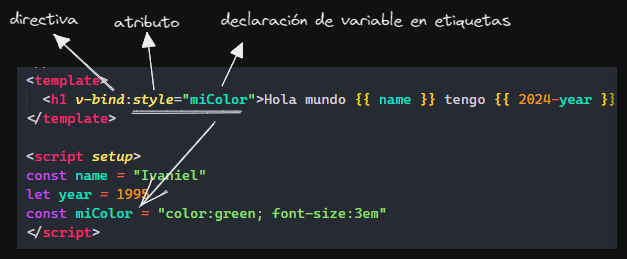
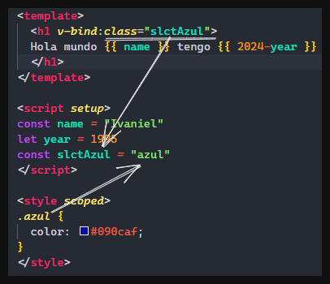
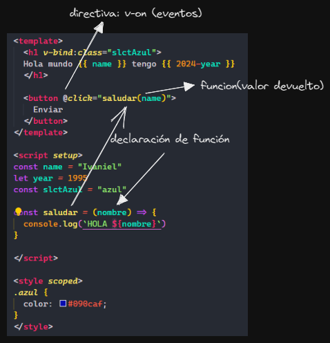
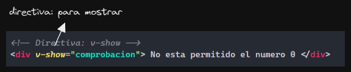
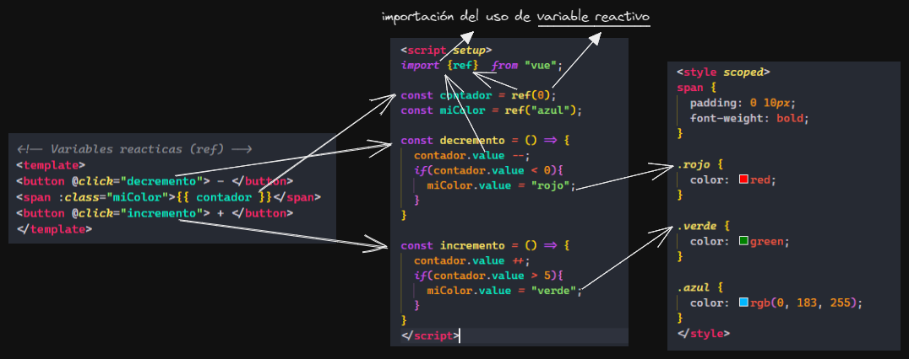
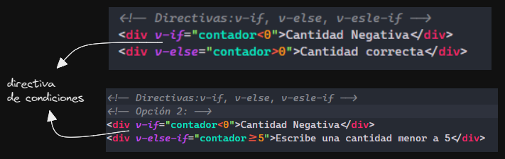
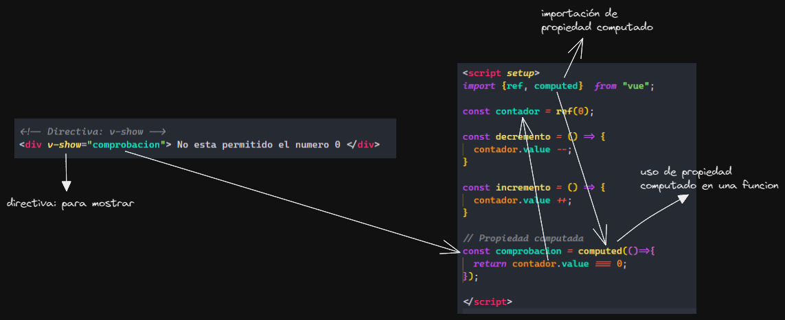
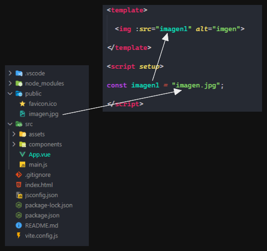
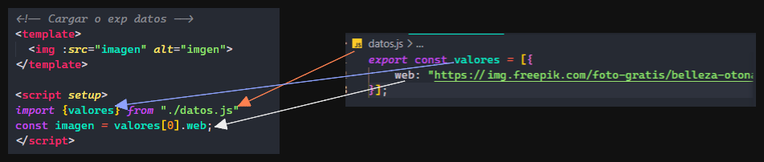

# Documentación de Vue 3

<p align="center">

</p>

## Creación del proyecto
#### Opción 1: desde vue
```bash
npm create vue@lasted
```
#### Opción 2: desde vite
```bash
npm create vite@lasted
```
#### Instala y gestiona de dependencia en el proyecto
```bash
npm install
```
#### Inicia un servidor de desarrollo local
```bash
npm run dev
```

## Estructura de vue

- Dentro del ``` <template> </template> ```, contendrá etiquetas, elementos html, eventos, funciones y etc..
- En el contenido se puede asignar una variable declarada o una función del script.
- Dentro del contenido con ```{{ variable o funciones }}``` asi se imprime una variable o se ejecuta una función.
- **setup** en el script se usa para no declarar las exportaciones o importaciones para usar métodos o funciones en el script (Implementación del vue3).
- **scope**, nos permite que todo los estilos declarados dentro de un etiqueta style afecte solo donde este ubicado la etiqueta, no afectara a los demás template.

## Directivas

- Las directivas se utilizaran para realizar eventos o algún tipo de acción, sin necesita de usar métodos como getByElement y querySelector y entre otros .
- Las directivas se declaran dentro de las etiquetas y algunos pueden ir acompañado con un atributo.
- Dentro de los atributos puede contener como value una ejecución de una variable o una función ```v-bind:atributo="variable o función" ```. 
- Las directivas tiene sus abreviaciones solo con poner ```:``` no es necesario poner ```v-bind``` o ```@ es v-on```.

### v-bind

- En Vue nos permite declarar estilos de css en js y luego asignar ese variable a una etiqueta a traves de la directiva v-bind, usando el atribudo ```class```.
- La directiva ```v-bind``` se utiliza para asociar dinámicamente atributos HTML a expresiones de datos en Vue.js.

### v-on

- La directiva ```v-on``` se utiliza para adjuntar escuchadores de eventos a elementos HTML para que reaccionen a eventos del DOM.
- ```@click``` es utilizado como un atributo dentro de la directiva ```v-on```, para realizar una acción y llama como value a una función donde ejecuta la lógica.

### v-show

- Oculta los elemento aplicando ```display: none;```.
- Su valor por defecto es true, ya que su valor es tipo bolean.
- A diferencia de v-if, v-show siempre renderiza el elemento en el DOM y solo lo controla con CSS.

## Variables reactivas (ref)

- Una variable reactivas es una variable que está vinculada a la vista y se actualiza automáticamente cuando cambia su valor.
    - ejemplo de ref: 
    ```js
        import { ref } from 'vue';

        const contador = ref(0);
        console.log(contador.value); // 0
        contador.value++; // Incrementa el valor de contador y actualiza la vista automáticamente
    ```
    - ejemplo de reactive:
    ```js
        import { reactive } from 'vue';

        const estado = reactive({
            mensaje: 'Hola',
            contador: 0
        });

        console.log(estado.mensaje); // 'Hola'
        estado.mensaje = 'Hola Mundo'; // Actualiza el mensaje y actualiza la   vista automáticamente
    ```
- Para usar variables reactivas se importa.
- Los variables que serán reactivas su valor se declara dentro de la palabra reservada ```ref(valor)```.
- Donde se use la variable reactiva dentro del script, llevara ```.value```.
- Excepto dentro del template no sera necesario que lleve ```.value```.


### Cuando usar ref y reactive
- **Variables ref:**
    - Ideal para valores primitivos simples o para acceder directamente al valor.
    - Mejor opción cuando necesitas reactividad solo en un nivel superficial y no necesitas iterar sobre propiedades.
    - Acceso al valor directo a través de ref.value.
    - Más adecuado para manejar valores simples como números, cadenas o booleanos.
- **Variables reactivas (reactive):**
    - Útiles para objetos complejos o estructuras de datos anidadas.
    - Proporcionan reactividad profunda, lo que significa que todos los niveles de propiedades del objeto son reactivos.
    - Más apropiado cuando necesitas iterar sobre propiedades de un objeto o realizar manipulaciones dinámicas en profundidad.
    - Mejor rendimiento en actualizaciones masivas de objetos complejos debido a su reactividad profunda

## Directiva de condiciones

- Nos permite realiza evaluación de condición en la etiqueta podemos combinar de la siguiente manera:
    - v-if y v-else
    - v-if y v-else-if
- La su estructura es: ```<etiqueta v-directiva="variable condición"> contenido </etiqueta>``` 

## Propiedad computada

- Para usarlo tiene que importarse al script.
- Siempre es reactiva por defecto.
- Se almacena en caché el resultado de su cálculo y solo se recalcula cuando alguna de las dependencias cambia.
- siempre retornara algo.
- Es una propiedad que se calcula dinámicamente en función de los datos reactivos existentes en tu aplicación.
- La propiedad computada es una excelente opción cuando necesitas realizar cálculos dinámicos basados en datos reactivos de manera eficiente y mantenible.
### Cuando usar la propiedad computada

1. **Transformaciones o formatos de datos**: Cuando necesitas mostrar datos en un formato específico o transformarlos de alguna manera para la presentación en la interfaz de usuario. Por ejemplo, convertir una fecha en un formato legible o aplicar algún formato numérico especial.

2. **Filtrado y ordenamiento de listas**: Cuando necesitas filtrar o ordenar una lista de datos basada en ciertos criterios. Puedes utilizar propiedades computadas para realizar estas operaciones de manera eficiente y mantener la lógica de filtrado y ordenamiento separada del marcado.

3. **Validación de datos**: Cuando necesitas validar ciertos datos o realizar cálculos condicionales basados en ellos. Por ejemplo, validar un formulario o calcular un subtotal basado en ciertos campos.

4. **Cálculos basados en múltiples datos**: Cuando necesitas realizar cálculos que dependen de múltiples datos reactivos en tu aplicación. Las propiedades computadas te permiten definir la lógica de cálculo de manera clara y concisa, sin necesidad de repetir código.

5. **Optimización de rendimiento**: Cuando necesitas optimizar el rendimiento de tu aplicación al evitar cálculos innecesarios. Las propiedades computadas almacenan en caché sus resultados y se recalculan solo cuando alguna de las dependencias cambia, lo que puede mejorar significativamente el rendimiento en aplicaciones con lógica compleja.

La propiedad computada es una excelente opción cuando necesitas realizar cálculos dinámicos basados en datos reactivos de manera eficiente y mantenible en tus aplicaciones Vue.js.

## Imágenes en Vue

- La carpeta /public, es recomendable guarda en esa carpeta por que no se compila la carpeta y no es necesario importar su uso en el script.
- La carpeta /assets borra los archivos que no vienen por defecto cada vez que reinicia el proyecto, Importar en el script para usar las imágenes, Compila para usar la imagen. 
- En la variable donde se guarde la dirección de la imagen no es necesario poner ```public/img/imagen.jpg```, porque VUE ya lo supone que esta hay, por eso solo se pone el nombre y extension de la img.
- La directiva ```:src="variable"``` en Vue.js se utiliza para enlazar dinámicamente el atributo src de un elemento HTML a una expresión en el modelo de datos de Vue.js. Esto permite cargar imágenes u otros recursos de forma dinámica según el estado de la aplicación.

## Cargar datos externos

- Se importa desde el script, se puede importar un archivo externo de otro carpeta o de la misma carpeta.
- Se importa el objeto con el que se quiere trabajar y se declara para poder usarlo dentro del código.

## Directivas mas usadas
Las directivas en Vue.js son atributos especiales que se aplican a los elementos HTML y les indican a Vue.js cómo debe comportarse el DOM.

- `v-for`:
   - La directiva `v-for` se utiliza para renderizar una lista de elementos basada en una matriz o un objeto iterable.
   - Ejemplo:
     ```html
     <ul>
       <li v-for="item in items" :key="item.id">{{ item.text }}</li>
     </ul>
     ```

- `v-model`:
   - La directiva `v-model` se utiliza para crear enlaces bidireccionales entre un elemento de formulario y los datos de Vue.js.
   - Ejemplo:
     ```html
     <input v-model="mensaje" placeholder="Ingrese un mensaje">
     ```

- `v-once`:
   - La directiva `v-once` se utiliza para renderizar un elemento o componente de forma estática, sin volver a evaluarlo.
   - Útil para elementos estáticos que no cambian después de su primera renderización.
   - Ejemplo:
     ```html
     <p v-once>{{ mensajeEstatico }}</p>
     ```

- `v-text`:
   - La directiva `v-text` se utiliza para establecer el contenido de un elemento con el texto renderizado desde una expresión de datos.
   - Es similar a la interpolación de texto `{{ }}`, pero se puede usar en combinación con otros atributos.
   - Ejemplo:
     ```html
     <span v-text="mensaje"></span>
     ```

Estas son solo algunas de las directivas más comunes en Vue.js. Hay muchas otras directivas disponibles que proporcionan funcionalidades adicionales para manipular el DOM y los datos de manera eficiente.